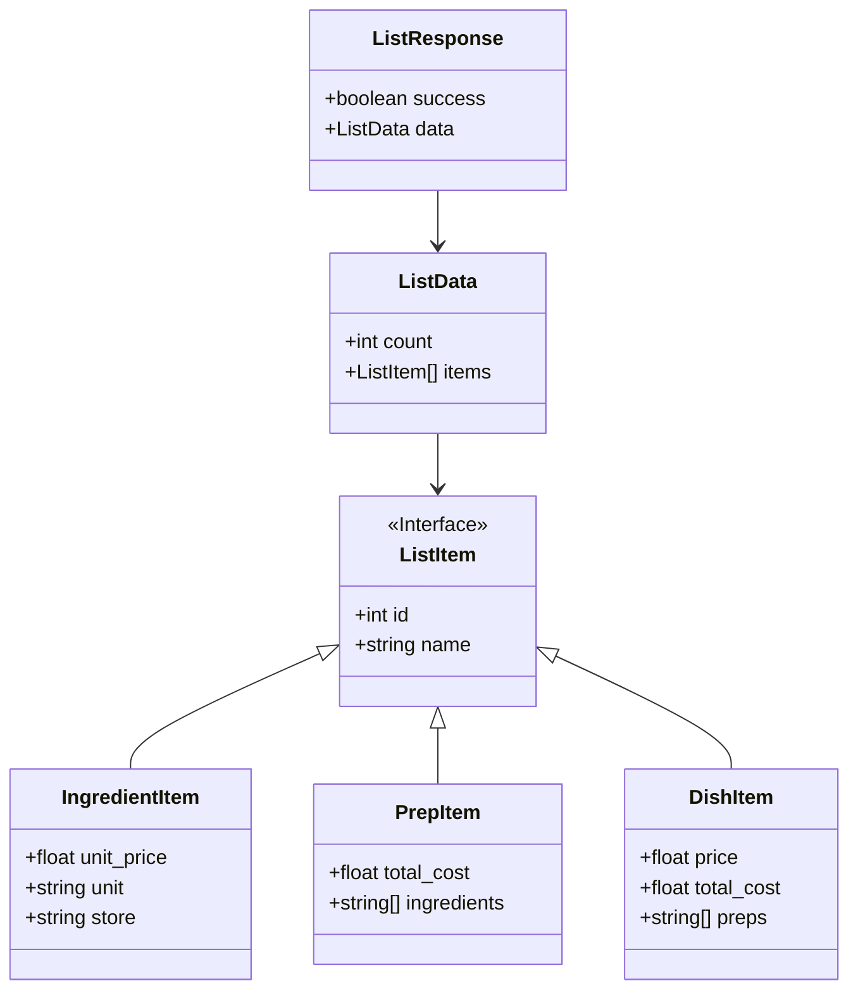

# 一覧（食材・仕込み・お品） 画面イベント設計

## 1. 概要

登録済みの食材、仕込み、およびお品の一覧を表示・管理（検索・遷移・削除）するための画面である。
タブ切り替えにより、それぞれのカテゴリの一覧をシームレスに確認できる。

## 2. 画面レイアウト構成

画面は、タブによる切り替えと、ヘッダーを固定したスクロール可能なテーブルで構成される。

```text
+---------------------------------------------------------------+
| [Header] 料理原価計算システム                (NAV) ホーム/検索/etc |
+---------------------------------------------------------------+
|                                                               |
|  [H] 一覧   [ 食材 ] [ 仕込み ] [ お品 ] (タブ選択)             |
|                                                               |
|  件数：全 8件                         [ 🔍 検索キーワード... ] |
|                                                               |
|  +---------------------------------------------------------+  |
|  | [Table Header]                                          |  |
|  | 名称              | 単価/金額        | 概要/購入先 | 操作     |  |
|  +---------------------------------------------------------+  |
|  | [Table Body (ScrollableArea)]                           |  |
|  | (link) 鶏モモ肉    | ¥ 0.48/g        | スーパーA  | [E][D]  |  |
|  | (link) 玉ねぎ      | ¥ 0.12/g        | スーパーB  | [E][D]  |  |
|  | ...                                                     |  |
|  +---------------------------------------------------------+  |
|                                                               |
+---------------------------------------------------------------+
* [E] = 編集ボタン (各詳細/編集画面へ遷移)
* [D] = 削除ボタン (確認モーダル表示)
* [Table Body] のみがスクロールし、ヘッダーや検索窓は常に表示される。
```

## 3. 画面要素

### 3.1 ヘッダー・検索入力

- **タイトル**: 「一覧」と表示。
- **検索窓**: 各タブに応じたプレースホルダーを表示し、リアルタイム検索を行う。
  - 食材タブ：「食材を検索...」
  - 仕込みタブ：「仕込みを検索...」
  - お品タブ：「お品を検索...」
- **件数表示**: 「全：N件」と現在の表示件数を表示。

### 3.2 カテゴリ選択タブ

- **タブ構成**: 「食材」「仕込み」「お品」の3つのタブ。
- **挙動**: 選択されたタブの下部にアクセントラインを表示し、対応する一覧テーブルを表示する。

### 3.3 一覧表示（テーブル）

テーブル部分は、データ件数が多い場合に内部スクロールし、画面全体のスクロールは発生しないように制御する。

#### A. 食材タブ

| 項目 | 説明 | 備考 |
| :--- | :--- | :--- |
| **食材名** | 食材の名称。リンクとして機能する。 | 遷移先：食材編集画面 |
| **単価** | 単位あたりの価格（例：￥0.48/g）。 | データベースから取得 |
| **購入先** | 主要な購入元名称。 | |
| **操作** | 編集アイコン（鉛筆）と削除アイコン（ゴミ箱）。 | |

#### B. 仕込みタブ

| 項目 | 説明 | 備考 |
| :--- | :--- | :--- |
| **仕込み名** | 仕込み料理の名称。リンクとして機能する。 | 遷移先：仕込み画面 |
| **単価** | 1gまたは1単位あたりの計算コスト。 | |
| **使用食材** | その仕込みに使用されている食材のリスト。 | リンク不要 |
| **操作** | 編集アイコン（鉛筆）と削除アイコン（ゴミ箱）。 | |

#### C. お品（メニュー）タブ

| 項目 | 説明 | 備考 |
| :--- | :--- | :--- |
| **お品** | メニュー（品名）。リンクとして機能する。 | 遷移先：お品画面 |
| **合計金額** | そのお品の原価合計。 | |
| **使用仕込み** | そのお品に使用されている仕込みのリスト。 | リンク不要 |
| **操作** | 編集アイコン（鉛筆）と削除アイコン（ゴミ箱）。 | |

### 3.4 削除確認モーダル

- **内容**: 「本当に削除しますか？」という確認メッセージ、対象の名前、および「キャンセル」「保存して削除」ボタンを表示する。

## 4. 画面イベント

### 4.1 検索機能

- 検索窓の入力内容に基づき、リアルタイムでリストをフィルタリングする。
- サーバー負荷軽減のため、入力から送信まで **300ms の Debounce** 処理を行う。
- 全てのデータはデータベースから最新の情報を取得して表示する。

### 4.2 遷移イベント

- **名称リンク / 編集アイコン**:
  - 食材タブの場合：食材編集画面へ遷移。
  - 仕込みタブの場合：仕込み画面へ遷移。
  - お品タブの場合：お品画面（料理詳細）へ遷移。

### 4.3 削除イベント

- 削除アイコン押下時、削除確認モーダルを表示。
- ユーザーが削除を確定した場合、バックエンドのDELETE APIを呼び出す。
- **削除失敗時の挙動（バリデーションエラー）**:
  - そのアイテムが他の「仕込み」や「お品」で使用されている場合、以下のエラーメッセージを表示する。
  - メッセージ例：「この食材は『[合わせ味噌](/preps/1)』で使用中のため削除できません。」
  - 「~」の部分は、該当するアイテムの編集・詳細画面へのリンクとする。
- 成功時は一覧を再取得して更新する。

### 4.4 ソート

- デフォルト表示および検索結果は、名称の **辞書順（昇順）** でソートして表示する。

## 5. API定義

### 5.1 レスポンス定義（一覧取得）

各カテゴリの特性に応じたレスポンス構造を以下に示す。



### 5.2 エンドポイント

| エンドポイント名 | メソッド | 説明 |
| :--- | :--- | :--- |
| `/api/ingredients` | GET | 食材一覧の取得。 |
| `/api/preps` | GET | 仕込み一覧の取得。 |
| `/api/dishes` | GET | お品（料理）一覧の取得。 |
| `/api/ingredients/:id` | DELETE | 指定された食材の削除。 |
| `/api/preps/:id` | DELETE | 指定された仕込みの削除。 |
| `/api/dishes/:id` | DELETE | 指定されたお品の削除。 |

## 6. 共通仕様・非機能要件

- **スクロール制御**: 
  - 画面全体のスクロールを禁止（`overflow: hidden`）。
  - テーブルのボディ部分のみをスクロール可能とし、ヘッダーは固定（Sticky Header）とする。
- **データ取得**: 全てデータベースから適切な値を取得して表示する。
