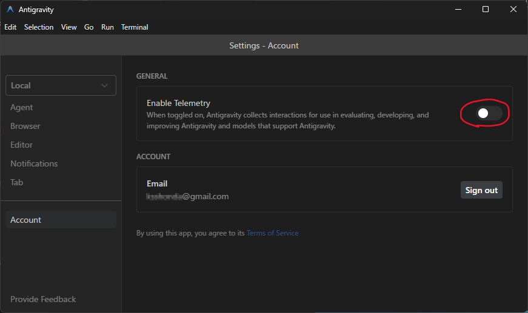
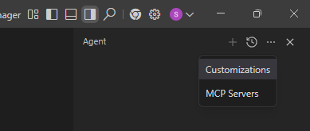
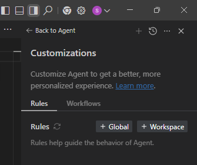
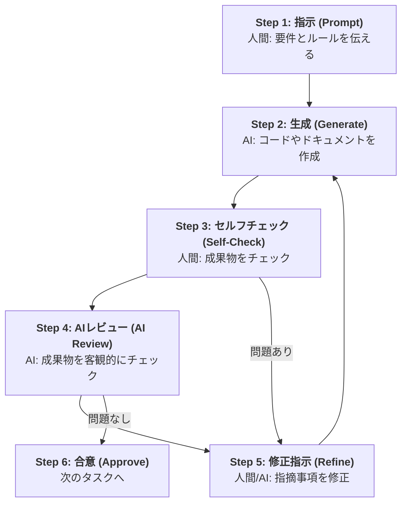
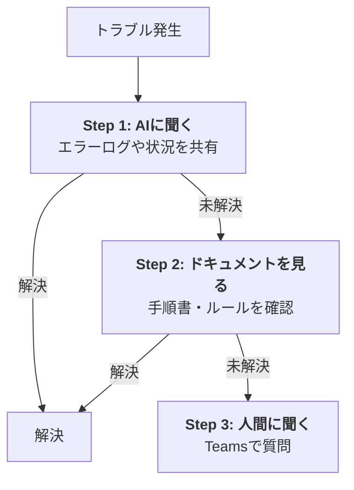
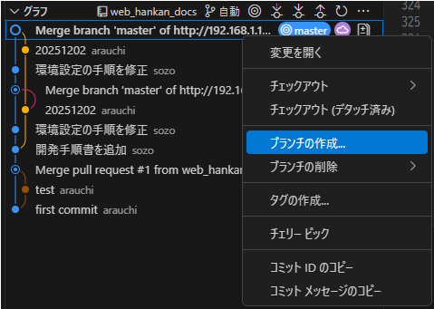
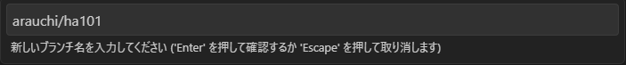
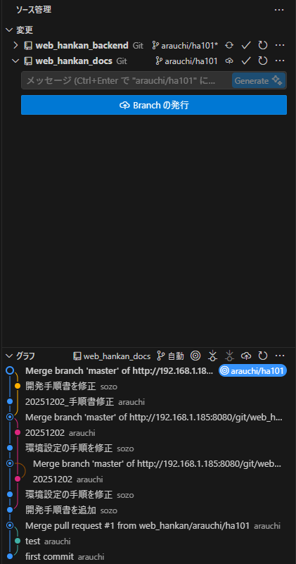

# WEB販売管理 AI駆動開発手順書

本資料は、WEB販売管理プロジェクトのAI駆動開発の手順書です。

## 目次

- [1. プロジェクト概要](#1-プロジェクト概要)
  - [1.1 本手順書の目的](#11-本手順書の目的)
  - [1.2 ターゲット読者](#12-ターゲット読者)
  - [1.3 システムアーキテクチャ](#13-システムアーキテクチャ)
  - [1.4 ディレクトリ構成](#14-ディレクトリ構成)
  - [1.5 開発サイクル（スプリント）](#15-開発サイクルスプリント)
- [2. 開発担当者の役割](#2-開発担当者の役割)
  - [2.1 要件定義・設計担当者](#21-要件定義設計担当者)
  - [2.2 フロントエンド担当者](#22-フロントエンド担当者)
  - [2.3 バックエンド担当者](#23-バックエンド担当者)
  - [2.4 AIの役割と立ち位置](#24-aiの役割と立ち位置)
- [3. 開発環境のセットアップ](#3-開発環境のセットアップ)
  - [3.1 プロジェクト共通のセットアップ](#31-プロジェクト共通のセットアップ)
  - [3.2 フロントエンド開発環境のセットアップ](#32-フロントエンド開発環境のセットアップ)
  - [3.3 バックエンド開発環境のセットアップ](#33-バックエンド開発環境のセットアップ)
- [4. 開発ワークフロー全体像](#4-開発ワークフロー全体像)
  - [4.1 基本サイクル](#41-基本サイクル)
  - [4.2 70点主義（イテレーティブ開発）](#42-70点主義イテレーティブ開発)
  - [4.3 フロントエンドファースト（UI駆動開発）](#43-フロントエンドファーストui駆動開発)
  - [4.4 AI協調サイクル詳細](#44-ai協調サイクル詳細)
  - [4.5 品質チェックフロー](#45-品質チェックフロー)
  - [4.6 コミュニケーションフロー](#46-コミュニケーションフロー)
- [5. 要件定義フェーズ](#5-要件定義フェーズ)
  - [5.1 業務要件と画面要件の確認（ユーザーヒアリング）](#51-業務要件と画面要件の確認ユーザーヒアリング)
  - [5.2 画面デザインの確認](#52-画面デザインの確認)
  - [5.3 要件定義書の作成](#53-要件定義書の作成)
- [6. 設計～単体テストフェーズ](#6-設計単体テストフェーズ)
  - [6.1 フロントエンド開発](#61-フロントエンド開発)
    - [6.1.1 画面仕様書作成フェーズ](#611-画面仕様書作成フェーズ)
    - [6.1.2 製造（実装）フェーズ](#612-製造実装フェーズ)
    - [6.1.3 単体テストフェーズ](#613-単体テストフェーズ)
  - [6.2 バックエンド開発](#62-バックエンド開発)
    - [6.2.1 API設計フェーズ](#621-api設計フェーズ)
    - [6.2.2 DDL作成フェーズ](#622-ddl作成フェーズ)
    - [6.2.3 OAS作成フェーズ](#623-oas作成フェーズ)
    - [6.2.4 処理説明書作成フェーズ](#624-処理説明書作成フェーズ)
    - [6.2.5 製造（実装）フェーズ](#625-製造実装フェーズ)
    - [6.2.6 単体テストフェーズ](#626-単体テストフェーズ)
- [7. 結合テストフェーズ](#7-結合テストフェーズ)
  - [7.1 疎通確認テスト](#71-疎通確認テスト)
  - [7.2 機能テスト](#72-機能テスト)
  - [7.3 パターン網羅テスト](#73-パターン網羅テスト)
  - [7.4 排他テスト](#74-排他テスト)
  - [7.5 画面基本操作テスト](#75-画面基本操作テスト)
  - [7.6 環境依存テスト](#76-環境依存テスト)
  - [7.7 セキュリティテスト](#77-セキュリティテスト)
  - [7.8 レスポンステスト](#78-レスポンステスト)
  - [7.9 結合テストの完了基準](#79-結合テストの完了基準)
- [8. システムテストフェーズ](#8-システムテストフェーズ)
  - [8.1 外部システム連携テスト](#81-外部システム連携テスト)
  - [8.2 シナリオテスト](#82-シナリオテスト)
  - [8.3 負荷テスト](#83-負荷テスト)
  - [8.4 障害復旧手順確認テスト](#84-障害復旧手順確認テスト)
  - [8.5 システムテストの完了基準](#85-システムテストの完了基準)

## 1. プロジェクト概要

本プロジェクトは、販売管理システムをWEBアプリケーションとして刷新するプロジェクトです。
AI（Antigravity）を最大限に活用し、高速かつ高品質な開発を行うことを目的としています。

### 1.1 本手順書の目的

本手順書は、開発担当者が「AIを使ってどのように開発を進めるか」を具体的に示したガイドラインです。
単なるツールの使い方だけでなく、AIへの指示の出し方（プロンプト）、AIが生成した成果物のレビュー方法、品質を担保するためのチェックポイントを網羅しています。

### 1.2 ターゲット読者

- 本プロジェクトに参画する全ての開発者（フロントエンド・バックエンド）
- AIを使った開発が初めて、または慣れていない方

### 1.3 システムアーキテクチャ

本プロジェクトでは、パフォーマンスと開発効率、およびAIによるコード生成の親和性を考慮し、以下の技術スタックを採用しています。

| レイヤー | 技術スタック | 選定理由・備考 |
| :--- | :--- | :--- |
| **Frontend** | **Vite + React** | 高速なビルドツールと開発サーバー。HMR（Hot Module Replacement）による快適な開発体験を提供。 |
| **Language** | **TypeScript** | 型安全性によるバグ低減。バックエンド（OAS）との型同期を容易にするため厳格な型チェックを行う。 |
| **Styling** | **Tailwind CSS** | ユーティリティファーストCSS。**AIが最も正確にコード生成できる**スタイリング手法であるため採用。 |
| **State Management** | **Jotai** | Atomicな状態管理。シンプルで学習コストが低く、TypeScriptとの親和性が高い。 |
| **Routing** | **React Router** | SPAのルーティング。宣言的なルーティング定義により保守性が高い。 |
| **Backend** | **Python + Flask** | シンプルかつ軽量なフレームワーク。AI（LLM）との親和性が高く、将来的なAI機能拡張も見据えて採用。 |
| **Database** | **MySQL** | 信頼性の高いリレーショナルデータベース。 |

### 1.4 ディレクトリ構成

本プロジェクトのディレクトリ構成は以下の通りです。

```text
C:\proj\dev_web_hankan/
├── web_hankan_front/           # フロントエンドリポジトリ (Vite + React)
│   ├── src/
│   │   ├── api/                # API通信関数 (Fetcher)
│   │   ├── assets/             # 静的ファイル（画像、アイコン等）
│   │   ├── components/         # Reactコンポーネント
│   │   │   ├── ui/             # 汎用UIパーツ (Button, Input等) - shadcn/uiベース
│   │   │   └── features/       # 機能単位のコンポーネント (CustomerForm, ProductList等)
│   │   ├── constants/          # 定数定義
│   │   ├── hooks/              # カスタムフック
│   │   ├── layouts/            # レイアウトコンポーネント
│   │   ├── lib/                # ユーティリティ、APIクライアント設定
│   │   ├── mocks/              # API Mock定義 (MSW)
│   │   │   ├── data/           # モックデータ (JSON/TS)
│   │   │   └── handlers/       # リクエストハンドラー定義
│   │   ├── pages/              # ページコンポーネント（ルーティング）
│   │   ├── schema/             # Zodバリデーションスキーマ
│   │   ├── stores/             # 状態管理 (Jotai)
│   │   ├── types/              # TypeScript型定義 (APIレスポンス型など)
│   │   ├── utils/              # ユーティリティ関数
│   │   └── vite-env.d.ts       # Vite環境変数の型定義
│   ├── public/                 # 公開ディレクトリ
│   │   └── mockServiceWorker.js # MSWサービスワーカー実行ファイル
│   ├── .env.example            # 環境変数テンプレート
│   ├── package.json            # 依存パッケージ定義
│   ├── vite.config.ts          # Vite設定
│   ├── vitest.config.ts        # Vitest設定（単体テスト）
│   ├── vitest.setup.ts         # Vitestセットアップ（テストグローバル設定）
│   └── tsconfig.json           # TypeScript設定
├── web_hankan_backend/         # バックエンドリポジトリ (Python + Flask)
│   ├── api/                    # APIモジュール
│   │   ├── controllers/        # APIエンドポイント（ルーティング、リクエスト/レスポンス処理）
│   │   ├── models/             # データベースモデル（SQLAlchemyモデル定義）
│   │   ├── services/           # ビジネスロジック（認証、システム設定等）
│   │   ├── validators/         # 入力値バリデーション
│   │   ├── database.py         # データベース接続設定
│   │   └── error.py            # エラーハンドリング
│   ├── tests/                  # 単体テスト（pytest）
│   ├── app.py                  # Flaskアプリケーションのエントリポイント
│   ├── config.py               # 環境設定（ローカル開発用）
│   ├── config_staging.py       # 環境設定（ステージング用）
│   ├── config_production.py    # 環境設定（本番用）
│   ├── requirements.txt        # Pythonパッケージ依存関係
│   └── 00_README.md            # バックエンド開発ガイド
├── web_hankan_docs/            # ドキュメントリポジトリ (DDL、OAS、処理説明書等)
│   ├── 00_共通/                # 共通定義（コード定義、マスタ定義等）
│   ├── 01_画面設計書/          # 画面設計書（画面仕様書含む）
│   ├── 02_テーブル定義/        # DDL（テーブル定義書、CREATE文）
│   ├── 03_OpenAPI/             # OAS（API仕様書）
│   ├── 04_処理説明書/          # API処理説明書（内部設計書）
│   ├── 99_figma/               # Figmaエクスポート画像
│   └── 開発手順書/             # 各種開発手順書
└── web_hankan_rules/           # 開発ルールリポジトリ (AIプロンプト用)
    ├── app/                    # アプリケーション固有ルール（PRレビュー等）
    └── docs/                   # 汎用開発ルール（DDL作成、OAS作成等）
```

#### 各リポジトリの役割

| リポジトリ名 | 役割 | 主な技術スタック |
| :--- | :--- | :--- |
| **web_hankan_front** | フロントエンド | Vite + React + TypeScript + Tailwind CSS + Jotai |
| **web_hankan_backend** | バックエンド | Python + Flask + SQLAlchemy + MySQL |
| **web_hankan_docs** | ドキュメント管理 | Markdown + YAML (OpenAPI) |
| **web_hankan_rules** | AI開発ルール | MD形式（Antigravity用プロンプト） |

#### 重要なディレクトリの説明

**フロントエンド:**

- `src/api/`: バックエンドAPIとの通信を担当する関数群
- `src/components/ui/`: 再利用可能な汎用UIコンポーネント（shadcn/uiベース）
- `src/components/features/`: 業務ロジックを含む機能別コンポーネント
- `src/schema/`: Zodを使用したフォームバリデーションスキーマ
- `src/stores/`: Jotaiによるグローバル状態管理
- `src/mocks/`: MSWによるAPIモック定義。`data/` 配下にレスポンス用のダミーデータを保持
- `public/mockServiceWorker.js`: MSWのサービスワーカー。ブラウザのリクエストをインターセプトするコアスクリプト
- `src/pages/`: ページコンポーネント（React Routerによるルーティング）
- `vite.config.ts`: Viteのビルド設定（プラグイン、エイリアス等）
- `vitest.config.ts`: Vitestの設定（単体テスト）
- `vitest.setup.ts`: Vitestの初期化・グローバル設定

**バックエンド:**

- `api/controllers/`: APIエンドポイントの定義（ルーティング）
- `api/models/`: データベーステーブルのモデル定義（SQLAlchemy）
- `api/services/`: ビジネスロジック層（Facade パターン）
- `api/validators/`: リクエストパラメータのバリデーション
- `tests/`: pytestによる単体テスト

**ドキュメント:**

- `01_画面設計書/`: 画面仕様と画面仕様書
- `02_テーブル定義/`: データベーステーブルのDDL
- `03_OpenAPI/`: RESTful APIの仕様書（OAS 3.0形式）
- `04_処理説明書/`: APIの内部処理フロー（内部設計書）

**開発ルール:**

- `app/`: プロジェクト固有のルール（PRレビュー基準、コーディング規約等）
- `docs/`: 汎用的な開発支援ルール（DDL作成、OAS作成、処理説明書作成等）

### 1.5 開発サイクル（スプリント）

本プロジェクトでは、アジャイル開発の手法を採用し、短期間のスプリント（反復開発サイクル）で進行します。
スプリントの期間や運用方法は、プロジェクトの規模、チーム構成、開発期間に応じて柔軟に調整してください。

#### 1.5.1 スプリント期間の目安

プロジェクトの規模に応じて、以下を参考にスプリント期間を設定します。

| プロジェクト規模 | 推奨スプリント期間 | 備考 |
| :--- | :--- | :--- |
| **小規模**（1〜2ヶ月） | **1週間** | 素早いフィードバックループで品質向上 |
| **中規模**（3〜6ヶ月） | **2週間** | 計画と実装のバランスが取りやすい |
| **大規模**（6ヶ月以上） | **2〜3週間** | 複雑な機能の実装に十分な時間を確保 |

> **💡 ポイント**: スプリント期間が長すぎると方向性のズレが大きくなり、短すぎると計画のオーバーヘッドが増えます。チームの状況に合わせて調整しましょう。

#### 1.5.2 基本的なスプリントの流れ

1. **スプリント計画（Planning）**: スプリント開始時にタスク（チケット）を割り当て、ゴールを明確にします。
2. **デイリースクラム（Daily Standup）**: 毎日短時間（10〜15分）で進捗とブロッカー（障害）を共有します。
   - 規模が小さい場合は週2〜3回でも可
3. **開発とレビュー**: 随時PRを作成し、レビューを受けてマージします。
4. **スプリントレビュー（Review）**: スプリント終了時に成果物をデモ形式で確認し、フィードバックを得ます。
5. **振り返り（Retrospective）**: スプリントの進め方を振り返り、改善点を次に活かします。

> **⚠️ 注意**: 形式的な運用にこだわりすぎず、チームの実情に合わせて柔軟に調整することが重要です。

## 2. 開発担当者の役割

本プロジェクトでは、要件定義・設計、フロントエンド、バックエンドで役割を分担しますが、お互いの領域を理解し、連携して進めることが重要です。

### 2.1 要件定義・設計担当者

#### 主な責務

- **ユーザー要件のヒアリング**: ユーザーから「何を実現したいか」を引き出し、システム要件に落とし込みます。
- **要件定義書の作成**: ヒアリング内容を整理し、開発チームとユーザーの両方が理解できる要件定義書を作成します。
- **画面設計**: ユーザーの業務フローに基づいた使いやすい画面設計（ワイヤーフレーム、Figma）を作成します。
- **API仕様の策定**: フロントエンドとバックエンドの橋渡しとなるAPI仕様（OpenAPI）を定義します。
- **テーブル設計**: 業務要件を満たすデータベース構造（DDL）を設計します。

#### 重要な心構え

1. **ユーザー視点の徹底**: 技術的な制約よりも、「ユーザーにとって使いやすいか」を最優先に考えます。
2. **曖昧さの排除**: 「適切に」「なるべく」といった主観的な表現を避け、具体的で測定可能な要件を定義します。
3. **AIとの協業**: 要件の整理、ユースケースの抽出、設計書のレビューなど、AIを積極的に活用して効率化します。（詳細は [5.3 要件定義書の作成](#53-要件定義書の作成) を参照）
4. **継続的な確認**: 要件定義後も、実装中に発覚した疑問点や矛盾点をユーザーと確認し、認識のズレを防ぎます。

### 2.2 フロントエンド担当者

#### 主な責務

- **UXの具現化と補完**: Figmaのデザインを再現するだけでなく、Loading/Error/Emptyなどの「見えない状態」や異常系の挙動を実装します。
- **Next.jsアーキテクチャの適正化**: Server ComponentsとClient Componentsを適切に使い分け、パフォーマンスとセキュリティを確保します。
- **API仕様へのフィードバック**: 「APIの最初の顧客」として、使いにくいAPI仕様があれば設計段階で改善を要求します。

#### 重要な心構え

1. **フロントエンドファースト（UI駆動）**: バックエンドの都合ではなく、「ユーザーがどう使いたいか」を起点に考えます。（詳細は [4.3 フロントエンドファースト](#43-フロントエンドファースト) を参照）
2. **"Happy Path" 以外への想像力**: 意地悪な操作や通信エラーを想定し、堅牢なUIを作ります。
3. **破壊的な変更への耐性**: 表示とロジックを分離し、変更に強いコンポーネント設計を心がけます。

### 2.3 バックエンド担当者

#### 主な責務

- **APIの提供**: フロントエンドからの要求に応じたデータを返すAPI（RESTful API）を実装します。
- **データベース設計・操作**: 業務要件に基づいたテーブル設計（DDL）と、効率的なデータアクセス処理を実装します。
- **ビジネスロジックの実装**: 複雑な計算や業務ルール（バリデーションなど）を実装します。

#### 重要な心構え

1. **フロントエンドファースト**: フロントエンド担当者が実装しやすく、使いやすいAPIを設計することを最優先します。（詳細は [4.3 フロントエンドファースト](#43-フロントエンドファースト) を参照）
2. **仕様の明確化**: 人間が見てもAIが見ても同じ結果になるよう、曖昧さを排除した設計書を作成します。
3. **積極的なコミュニケーション**: 不明点は独断で解決せず、必ず確認を取って認識のズレを防ぎます。

### 2.4 AIの役割と立ち位置

AI駆動開発において、AIと人間は以下のような関係性で協業します。

- **AI (Coder)**:
  - 命令された通りのコードを高速に書く「超優秀な新人プログラマー」。
  - 疲れを知らず、何度でも修正に応じる。
  - ただし、指示が曖昧だと間違った解釈をする。全体像を把握するのは苦手。

- **人間 (Director / Reviewer)**:
  - AIに的確な指示（プロンプト）を出す「監督・指示者」。
  - AIが書いたコードが正しいか、仕様を満たしているかを判断する「責任者」。
  - 最終的な品質責任は人間が持つ。

> **⚠️ 注意**: 「AIが書いたから正しいはず」という思考停止は厳禁です。必ず自分の目で検証してください。
>
> **🛑 重要: 作成とレビューのセッション分離**
>
> 設計書やコードを **「作成するプロンプト」** と、それらに対する **「AIレビューを実施するプロンプト」** は、**必ず別のチャットセッション（New Chat）** で行ってください。
>
> - **理由**: 同じセッションで続けると、AIは直前の文脈（自分が生成した内容）を「前提となる正解」として扱ってしまい、客観的な指摘ができなくなるためです。
> - **手順**: 「作成」が終わったら、一度そのセッションを離れ、**新しいチャット画面を開いてから** 成果物を貼り付けてレビューを依頼してください。

## 3. 開発環境のセットアップ

### 3.1 プロジェクト共通のセットアップ

#### 3.1.1 プロジェクトフォルダの作成

Cドライブの `proj` フォルダ配下に `dev_web_hankan` フォルダを作成します。

```bash
mkdir C:\proj\dev_web_hankan
```

#### 3.1.2 Gitのセットアップ

Gitが未インストールの場合は、以下の共有フォルダにある最新日付のインストーラを実行してインストールしてください。

```
\\esoumus2\フリーソフト\01_開発ツール\Git for Windows\
```

インストール後、以下の初期設定を行います。

```bash
git config --global user.name "Your Name" # ローマ字氏名
git config --global user.email "your.email@example.com" # メールアドレス
git config --global core.quotepath false # 文字化け対策
```

#### 3.1.3 Javaのインストール

Javaが未インストールの場合は、以下のサイトにアクセスし、Javaをインストールしてください。

```
https://www.oracle.com/jp/java/technologies/downloads/#jdk25-windows

x64 Installer を選択する。
```

インストール後、コマンドプロンプトを起動し、以下のコマンドを実行して、Javaが正しくインストールされているか確認してください。

```bash
java -version
```

以下のようにバージョンが表示されれば、Javaが正しくインストールされています。

```
java version "25.0.1" 2025-10-21 LTS
Java(TM) SE Runtime Environment (build 25.0.1+8-LTS-27)
Java HotSpot(TM) 64-Bit Server VM (build 25.0.1+8-LTS-27, mixed mode, sharing)
```

#### 3.1.4 Antigravityのセットアップ

1. 以下の共有フォルダにある最新日付のインストーラを実行してインストールしてください。
    `\\esoumus2\フリーソフト\07_統合開発環境\Antigravity`
2. Antigravityを起動し、画面左にある「拡張機能」のアイコンをクリックし、"This can be changed in <u>Antigravity settings</u>." のリンクから設定画面を開いて、以下を記入してください。
   - Marketplace Item URL: `https://marketplace.visualstudio.com/items`
   - Marketplace Gallery URL: `https://marketplace.visualstudio.com/_apis/public/gallery`
3. Antigravityを再起動し、以下の拡張機能をインストールしてください。
    - Japanese Language Pack
    - ESLint
    - Prettier - Code formatter
    - Git History
    - Markdown All in One
    - Markdown PDF
    - Markdown Preview Enhanced
    - Markdown Preview Mermaid Support
    - Interactive Markdown Table Editor
    - markdownlint
    - Antigravity Cockpit
4. 上記 2 の設定を元に戻して（Marketplace Item URL、Marketplace Gallery URL ともクリアして）、Antigravityを再起動してください
5. メニューの「ヘルプ」「更新を確認」を選択し、Antigravityを更新してください。
6. **設定**: `Ctrl + ,` で設定を開き、以下を設定します。
   - `Editor: Format On Save`: `ON`
   - `Prettier: Require Config`: `ON`
7. **Telemetry無効化**: `Account` > `Enable Telemetry` を `OFF` に設定してください。
    **注）AIに学習されないようにするための設定です。必ずOFFに設定してください。**



8. AntigravityのAIチャットで必ず含めたいプロンプトの設定
   - Aitigravityの右上にある「...」をクリックして、「Customization」のメニューを選択します。

   - Customizationの「Rules」タブにある「+Global」ボタンをクリックすると、エディタでGEMINI.mdの編集が開始されます。(「+Workspace」ボタンは、ワークスペース内で共通のプロンプトを設定するためのものです。)

   - このGEMINI.mdを編集することで、AntigravityのAIチャットで必ず含めたいプロンプトを設定できます。
   - 初期設定として、以下のプロンプトをGEMINI.mdにコピペして保存してください。
    ```
    以下のルールを必ず守ってください。
    ・あなたが処理中に作成する一時的なコマンドやファイルのパスに、絶対に全角文字を使用しないようにしてください。
    ・あなたが扱うフォルダ名やファイル名には全角文字が含まれることがあります。あなたが処理中に作成する一時的なコマンドで、それらが絶対に文字化けしないように考慮して処理を行ってください。
    ・ワークスペースの直下にあるAGENTS.mdを読み込んでください。
    ・その他のディレクトリにアクセスする場合、そこまでの階層の途中にAGENTS.mdがある場合は、それらのAGENTS.mdも読み込んでください。
    ・不明な点や不安なことがあれば、些細なことでも勝手に判断せず、私に必ず相談してください。
    ・あなたの回答は、日本語でお願いします。
    ```

    - プロジェクト固有の共通プロンプトはAGENTS.mdファイルに記述し、ワークスペース内に配置すると、AntigravityのAIチャットで含められるようになります。

##### 3.1.3.1 WEBセキュリティガイドラインを共通で読み込ませる設定
- 上記のGEMINI.mdの設定を行ったうえで、AGENTS.mdファイルに以下の記載を追加することで、設計・製造・各種レビュー時にWEBセキュリティガイドラインのルールが読み込まれるようになります。
```
# 設計・製造・各種レビュー時
以下のルールファイルを必ず読み込むこと。
【ルールファイル配置ディレクトリ】\common\web_security.md
```

#### 3.1.5 リポジトリのクローン

プロジェクトで使用する4つのリポジトリをクローンします。

```bash
cd /c/proj/dev_web_hankan
git clone http://192.168.1.185:8080/web_hankan/web_hankan_front.git
git clone http://192.168.1.185:8080/web_hankan/web_hankan_backend.git
git clone http://192.168.1.185:8080/web_hankan/web_hankan_docs.git
git clone http://192.168.1.185:8080/web_hankan/web_hankan_rules.git
```

### 3.2 フロントエンド開発環境のセットアップ

#### 3.2.1 Node.js 実行環境の準備 (Volta推奨)

本プロジェクトでは、Node.jsのバージョン管理に **Volta** を推奨します。
`web_hankan_front` リポジトリには `package.json` に `volta` フィールドが定義されており、自動的に推奨バージョンが適用されます。

- **パッケージマネージャー**: **`npm`** を使用します（`yarn`, `pnpm` は禁止）。

#### 3.2.2 Antigravity拡張機能のインストール

フロントエンド開発に必要な拡張機能をインストールします。

- **Tailwind CSS IntelliSense**: クラス名補完（AIの推論にも重要）
- **PostCSS Language Support**: CSSエラー抑制
- **Pretty TypeScript Errors**: エラー表示改善

#### 3.2.3 依存パッケージのインストールと初期化

```bash
cd web_hankan_front
npm ci
cp .env.example .env.local
```

#### 3.2.4 環境設定ファイルの構成

環境ごとの設定値は `.env` ファイルで管理します。

| ファイル名 | 用途 | 備考 |
| :--- | :--- | :--- |
| `.env.local` | ローカル開発用 | Git管理外。各自で作成。APIのベースURLなどを設定。 |
| `.env.development` | 開発サーバー用 | 開発環境（Staging）向け設定。 |
| `.env.production` | 本番サーバー用 | 本番環境向け設定。 |

**設定例（`.env.local`）:**

```bash
VITE_API_BASE_URL=http://localhost:5000
```

※ 設定値の詳細は `.env.example` を参照してください。

#### 3.2.5 ローカルサーバーの起動確認

```bash
npm run dev
```

`http://localhost:5174` にアクセスし、画面が表示されることを確認します。

#### 3.2.6 Gitブランチ戦略（フロントエンド）

フロントエンド開発では、以下の命名規則で作業用ブランチを作成します。

- **命名規則**: `{作業者名}/{機能名または画面ID}`
  - 例: `yamada/login-screen`, `suzuki/A011-product-entry`

- **作成フロー**:
  - `develop` ブランチを最新化する。

### 3.3 バックエンド開発環境のセットアップ

#### 3.3.1 Python for Windowsのセットアップ

1. 以下の共有フォルダにあるPythonのインストーラ（**Ver3.12**）を実行し、インストールしてください。

    ```text
    \\esoumus2\フリーソフト\10_言語・開発SDK関連\Python\python-3.12.10-amd64.exe
    ```

2. 以下のチェックボックスを**必ず**オンにしてください。
    - `Add python.exe to PATH`
3. `Install Now` をクリックしてインストールします。
4. インストール完了画面で `Disable path length limit` が表示された場合は、クリックして制限を解除してください。
5. ターミナル（PowerShellまたはコマンドプロンプト）を開き、インストールを確認します。

    ```bash
    python --version
    ```

#### 3.3.2 uvのセットアップ

本プロジェクトでは、高速なPythonパッケージマネージャーである `uv` を使用します。

1. PowerShellを起動し、以下のコマンドを実行してインストールします。

    ```powershell
    powershell -ExecutionPolicy ByPass -c "irm https://astral.sh/uv/install.ps1 | iex"
    ```

2. インストール後、ターミナルを再起動して以下のコマンドで確認します。

    ```bash
    uv --version
    ```

3. 以下のコマンドで、Pythonのバージョン管理を有効化します。

    ```bash
    uv python install 3.12
    ```

#### 3.3.3 Antigravity拡張機能のインストール

バックエンド開発に必要な拡張機能をインストールします。

- **Python**: 言語サポート
- **Python Debugger**: デバッグ機能
- **Ruff**: 高速リンター

#### 3.3.4 マルチワークスペースの構築

開発効率向上のため、マルチルートワークスペースを作成します。

1. 「web_hankan_docs\開発手順書\設定ファイル\web_hankan.code-workspace」を「C:\proj\dev_web_hankan」にコピーする。
   → 次回以降、「web_hankan.code-workspace」からAntigravityを起動することで、マルチルートワークスペースが有効になった状態で起動できます。

**メリット**: AIに対してリポジトリを跨いだ指示（「docsの設計書を見てbackendを修正」など）が可能になります。

#### 3.3.5 A5SQL Mk-2のセットアップ

A5SQL Mk-2は、データベース設計・管理に使用するツールです。ER図の作成、DDLの生成・実行、データベースの参照・編集が可能です。

1. 以下の共有フォルダにある最新版のインストーラを実行してインストールしてください。

    ```text
    \\esoumus2\フリーソフト\09_データベース関連\A5 SQL Mk-2\
    ```

2. インストール後、A5SQL Mk-2を起動し、データベース接続設定を行います。
3. **接続設定**:
   以下の情報をリーダーから共有してもらう。
    - ホスト名
    - ポート番号
    - ユーザーID
    - パスワード
    - データベース
    - キャラクタセット

**主な用途:**

- **ER図の作成・可視化**: AIが生成したDDLの妥当性を視覚的に確認
- **DDLの生成・実行**: AIが作成したDDLをデータベースに反映
- **テーブル定義の確認・編集**: AIの生成結果を確認し、必要に応じて微調整
- **データの参照・編集**: API動作確認時のデータ確認、テストデータの投入
- **SQLクエリの実行・検証**: AIが生成したSQLの動作確認

> **💡 AI駆動開発でのポイント**: A5SQLは「AIが生成した設計やSQLを人間が確認・検証するツール」として位置づけます。AIに設計させた後、A5SQLで視覚的に確認することで、設計の妥当性を素早く判断できます。

#### 3.3.6 環境設定ファイルの構成

環境ごとの設定値は `.env` ファイルで管理します。

| ファイル名 | 用途 | 備考 |
| :--- | :--- | :--- |
| `.env.local` | ローカル開発用 | Git管理外。各自で作成。データベース接続情報などを設定。 |
| `.env.development` | 開発サーバー用 | 開発環境（Staging）向け設定。 |
| `.env.production` | 本番サーバー用 | 本番環境向け設定。 |

※ 設定値の詳細は `.env.example` を参照してください。


#### 3.3.7 依存パッケージのインストールと仮想環境の構築

`uv` を使用して、プロジェクト独自の仮想環境を作成し、必要なパッケージをインストールします。

1. Antigravity上で、バックエンドのディレクトリに移動します。

    ```bash
    cd C:\proj\dev_web_hankan\web_hankan_backend
    ```

2. 以下のコマンドを実行して、pythonのバージョンを3.12に固定します。

    ```bash
    uv python pin 3.12
    ```

3. 以下のコマンドを実行して、仮想環境（`.venv`）を作成します。

    ```bash
    uv sync
    ```

    ※ `uv sync` コマンドは、`pyproject.toml` と `uv.lock` を元に、仮想環境の作成と依存関係のインストールを自動的に行います。

4. `.env.local` ファイルを作成します。

   - **PowerShell の場合**:
     ```powershell
     Copy-Item .env.example .env.local
     ```
   - **Git Bash の場合**:
     ```bash
     cp .env.example .env.local
     ```

5. 作成した `.env.local` を開き、自分の開発環境に合わせて設定値を変更します。

   **設定例（`.env.local`）:**

   ```bash
   # Flask設定
   FLASK_ENV=development
   FLASK_DEBUG=True

   # データベース接続設定
   DB_USER=web_hankan
   DB_PASSWORD=web_hankan
   DB_HOST=192.168.1.72
   DB_PORT=3306
   DB_NAME=web_hankan

   # セキュリティ設定
   SECRET_KEY=your-local-secret-key
   JWT_SECRET_KEY=your-local-jwt-secret-key

   # アカウントロック設定
   MAX_LOGIN_FAILURE_COUNT=3
   ACCOUNT_LOCK_MINUTES=1

   # CORS設定
   CORS_ORIGINS=http://localhost:5174,http://localhost:3000

   # サーバー起動設定
   SERVER_HOST=0.0.0.0
   SERVER_PORT=5000

   # ログ設定
   LOG_LEVEL=DEBUG
   LOG_FILE_PATH=C:/app/app_web_hankan.log

   # メール設定
   MAIL_DEBUG_FLAG=0
   MAIL_PORT=25
   MAIL_SERVER='setouchisystem-co-jp.mail.protection.outlook.com'
   MAIL_USERNAME='web-hankan@setouchisystem.co.jp'
   MAIL_PASSWORD=None
   MAIL_SENDER='info@setouchisystem.co.jp'
   MAIL_USE_TLS=False
   MAIL_USE_SSL=False
   MAIL_DEFAULT_CHARSET='utf-8'

   # ドメイン名の設定を追加
   DOMAIN_NAME='http://localhost:5174'
   ```

   ※ 設定値の詳細は `.env.example` または `03_環境設定ファイルについて.md` を参照してください。

6. Antigravity上で、Ctrl + Shift + P を押して、`Python: Select Interpreter` を選択します。

7. 「web_hankan_backend」を選択する。

8. 「Python 3.12.x ('.venv': venv) .\.venv\Scripts\python.exe」のように表示されているインタープリタを選択します。
   - `.venv` フォルダ内のPythonインタープリタであることを確認してください。
   - バージョンは `3.12.x` （xはマイナーバージョン）と表示されます。

#### 3.3.8 ローカルサーバーの起動確認

1. `.env.local` ファイルが正しく設定されていることを確認してください。

2. 以下のコマンドを実行してサーバーを起動します。

   ```bash
   uv run python app.py
   ```

   ※ `uv run` コマンドを使用することで、仮想環境を自動的にアクティベートしてアプリケーションを起動できます。

   または、仮想環境を手動でアクティベートしてから起動することもできます。

   - **PowerShell の場合**:
     ```powershell
     .venv\Scripts\activate
     python app.py
     ```
   - **コマンドプロンプトの場合**:
     ```cmd
     .venv\Scripts\activate.bat
    ```

3. ブラウザで `http://localhost:5000/api/aa999` にアクセスし、以下の結果が返ってくることを確認します。

```json
{
  "data": null,
  "responseCd": 0
}
```

## 4. 開発ワークフロー全体像

本プロジェクトでは、AIと人間が協力して開発を進める「AI駆動開発」を採用します。

### 4.1 基本サイクル

AI駆動開発は、人間が一方的に命令するのではなく、AIと対話しながら作り上げていくプロセスです。以下のサイクルを高速に回すことで、品質と速度を両立させます。



#### 各ステップの詳細

1. **Step 1: 指示 (Prompt)**
   - **役割**: 人間（Director）
   - **内容**: 「何を作りたいか」「どのルールに従うべきか」を明確に伝えます。曖昧な指示は曖昧な成果物を生みます。
   - **ポイント**: 関連するファイル（`@filename`）やルール（`.md`）を必ずコンテキストとして渡します。

2. **Step 2: 生成 (Generate)**
   - **役割**: AI（Coder）
   - **内容**: 指示に基づいて、コードの記述、ドキュメント作成、リファクタリングなどを実行します。
   - **ポイント**: AIは疲れを知らないため、何度でも書き直しを依頼できます。

3. **Step 3: セルフチェック (Self-Check)**
   - **役割**: 人間（Reviewer）
   - **内容**: AIが生成したものが「正しく動くか」「要件を満たしているか」を確認します。
   - **ポイント**: **ここが最も重要です。** AIの成果物を鵜呑みにせず、必ず動作確認やコードレビューを行ってください。

4. **Step 4: AIレビュー (AI Review)**
   - **役割**: AI（Reviewer）
   - **内容**: 人間がチェックした後、さらにAIに「客観的な視点」でレビューさせます。
   - **ポイント**: 型定義の漏れ、スペルミス、セキュリティリスクなど、人間が見落としがちな点をAIに指摘させます。

5. **Step 5: 修正指示 (Refine)**
   - **役割**: 人間（Director）
   - **内容**: 検証で見つかった問題点や、より良くするための改善案をAIに伝えます。
   - **ポイント**: 「ダメ」と言うだけでなく、「〇〇が××になっているので、△△に修正して」と具体的に指示します。

6. **Step 6: 合意 (Approve)**
   - **役割**: 人間（Approver）
   - **内容**: 品質基準を満たしたと判断し、そのタスクを完了とします（コミット、PR作成など）。

### 4.2 70点主義（イテレーティブ開発）

AI駆動開発において最も重要なマインドセットは、**「最初から100点を目指さない」** ことです。
AIに対して完璧な指示（プロンプト）を作ろうとして時間を浪費するよりも、まずは70点の出来でも良いので素早く成果物を生成させ、そこから対話を通じて完成度を高めていく方が圧倒的に効率的です。

#### 4.2.1 なぜ70点主義なのか

- **プロンプト作成のコスト削減**: 完璧な指示書を書くには時間がかかります。大まかな指示でまず作らせることで、着手までの時間を短縮できます。
- **フィードバックの具体化**: 実際に動くコードや画面を見ることで、「もっとこうしたい」「ここは違う」という具体的な改善点が見えてきます。
- **心理的ハードルの低下**: 「失敗しても修正すれば良い」と考えることで、開発の心理的負担を減らせます。

#### 4.2.2 進め方の具体例

1. **First Pass (70点: まず動くもの)**:
   - **指示**: 「〇〇機能の基本的なCRUDを作って。デザインはシンプルでOK。」
   - **成果**: とりあえず動くが、バリデーションが甘かったり、デザインが崩れている状態。

2. **Second Pass (85点: 要件を満たすもの)**:
   - **指示**: 「バリデーションを追加して。必須項目は〇〇と××。デザインはTailwindのこのクラスを使って整えて。」
   - **成果**: 実用レベルに近づく。

3. **Final Polish (100点: 品質の高いもの)**:
   - **指示**: 「エラー時のメッセージをユーザーフレンドリーにして。ローディング中のスピナーを追加して。」
   - **成果**: リリース可能な品質。

> **💡 ポイント**: AIは「優秀な新人」です。一度で完璧な仕事を期待せず、指示出しとレビューを繰り返して育てていく感覚で接してください。

### 4.3 フロントエンドファースト（UI駆動開発）

ユーザーが直接触れる「画面（UI）」を起点に開発を進める手法です。
バックエンドのデータベース構造から考えるのではなく、「ユーザーにとって使いやすい画面は何か？」を最初に定義し、それに合わせてバックエンドを作るというアプローチです。

#### 4.3.1 従来の手法との違い

| 項目 | 従来の手法（DB駆動） | フロントエンドファースト（UI駆動） |
| :--- | :--- | :--- |
| **起点は？** | データベース設計 (ER図) | 画面デザイン (Figma / UI) |
| **API定義は？** | バックエンド都合で決まる | フロントエンドの要求で決まる |
| **開発順序は？** | バックエンド → フロントエンド | フロントエンド（モック） → バックエンド |
| **メリット** | データの整合性が保ちやすい | **使いやすいUIになり、手戻りが少ない** |

#### 4.3.2 具体的なアクション

1. **UI駆動のAPI定義**:
   - バックエンドのテーブル構造をそのまま返すのではなく、「フロントエンドが表示しやすいJSON構造」を正としてAPIを定義します。
   - 例: `status: 1` だけでなく `status_label: "完了"` もセットで返す、日付は `YYYY/MM/DD` に整形して返す、など。

2. **モックデータによる先行開発**:
   - バックエンドAPIの完成を待たず、ハードコードしたダミーデータ（モック）を使ってUIの実装と動作確認を完了させます。
   - これにより、バックエンド開発と並行してUIのフィードバックループを回せます。

3. **フロントエンドからの積極的な要求**:
   - 「この画面ではこのデータが必要だから、APIに追加してほしい」と、フロントエンド担当者が主導権を持ってAPI仕様を提案します。

この方針により、ユーザー視点での使いやすさを最優先しながら、効率的に開発を進めることができます。

### 4.4 AI協調サイクル詳細

Antigravityには主に2つのモードがあり、タスクの性質に応じて使い分けることで開発効率を最大化できます。

#### 4.4.1 モードの使い分け基準

| 特徴 | Fastモード | Planningモード |
| :--- | :--- | :--- |
| **概要** | タスクを直接実行する | 実行前に計画（Plan）を立てる |
| **得意なこと** | 単純なタスク、素早い修正 | 深い調査、複雑なタスク、協調作業 |
| **速度** | 速い | じっくり（計画フェーズがあるため） |
| **ファイル操作** | 可能 | 可能 |
| **トークン消費量** | 少ない | 多い |

#### 4.4.2 具体的な活用シーン

**🚀 Fastモードを使うとき（単純・高速）**:
- **単純な修正**: 「このボタンの色を赤に変えて」「この関数のバグを直して」
- **コード生成**: 「日付フォーマット関数を作って」
- **質問・調査**: 「このエラーの原因は何？」「このライブラリの使い方は？」

**🏗️ Planningモードを使うとき（複雑・計画的）**:
- **機能実装**: 「仕様書に従って、見積登録画面全体を実装して」
- **深い調査**: 「既存のコードベースを解析して、リファクタリング方針を提案して」
- **複数ファイルに跨る変更**: 「APIの仕様変更に合わせて、フロントエンドとバックエンドの両方を修正して」

> **💡 コツ**: 基本的には「Fastモード」でAIに方針を相談したり、ちょっとした作成や修正を行い、複雑な処理が必要になった場合のみ「Planningモード」に切り替えて実行することで、トークン消費量を抑え、上限到達までの時間を延ばすことができます。

### 4.5 品質チェックフロー

開発した機能をプルリクエスト（PR）として提出するまでの標準的なチェックフローです。

1. **AIに生成させる**:
   - Antigravityを活用し、コードやドキュメントを作成させます。

2. **AIの成果物を自分自身でチェックする（セルフチェック）**:
   - **共通**: ビルドエラー、Lintエラー（波線）がないこと。
   - **フロントエンド**: 画面崩れがないか、コンソールエラーが出ていないか、基本的な操作ができるか。
   - **バックエンド**: テストが通るか、APIレスポンスが仕様通りか。

   > **⚠️ 絶対にやってはいけないこと**:
   > AIが生成したコードやドキュメントを、**中身を理解せず、動作確認もせずにそのままプルリクエストを出すことは厳禁**です。
   > AIは平気で嘘をついたり、セキュリティ的に危険なコードを書いたりします。「AIが書いたから大丈夫」という思考は捨て、必ず自分の目で確認し、責任を持って提出してください。

3. **AIにレビュー、修正させる**:
   - 作成したコードをAIにレビューさせ、指摘事項があれば修正させます。

4. **プロジェクトリーダーまたはサブリーダーにレビューを依頼する**:
   - 上記をクリアした後、PRを作成してレビューを依頼します。

### 4.6 コミュニケーションフロー

開発中にエラーや不明点に遭遇した場合の、標準的な解決プロセスです。
安易に人間に聞く前に、AIとドキュメントを活用して自己解決を図る姿勢が重要です。



#### 各ステップの詳細

1. **Step 1: AIに聞く（First Action）**
   - エラーログや現状のコードをそのままAIに貼り付け、「原因と解決策を教えて」と聞きます。
   - **コツ**: 「なぜこうなるの？」「どう修正すればいい？」と深掘りして質問します。

2. **Step 2: ドキュメントを見る（Self Check）**
   - プロジェクトのルールファイル（`.md`）や、この開発手順書を確認します。
   - 類似の実装箇所（既存コード）を参考にするのも有効です。

3. **Step 3: 人間に聞く（Last Resort）**
   - 上記を試しても解決しない場合、Teamsで有識者やリーダーに質問します。
   - **質問時のルール**: 丸投げは禁止です。以下のテンプレートを使って状況を整理してください。

   > **📝 質問テンプレート**
   > - **【現状】**: 何をしようとして、どんなエラーが出ているか（スクショやログ）
   > - **【試したこと】**: AIに何を聞いたか、どのドキュメントを見たか
   > - **【AIの回答】**: AIはどう分析したか（解決しなかった理由）
   > - **【仮説】**: 自分なりにどこが怪しいと思っているか

## 5. 要件定義フェーズ

開発に着手する前に、何を作るのか（要件）を明確にします。

### 5.1 業務要件と画面要件の確認（ユーザーヒアリング）

要件定義フェーズは、システムを利用するユーザーから「何を実現したいか」を引き出し、合意形成を行う重要なプロセスです。ユーザーの声に耳を傾け、真のニーズを理解しましょう。

#### 5.1.1 業務要件のヒアリングと理解（Why & Who）

ユーザーへのヒアリングを通じて、「なぜこの機能が必要なのか」「誰がどう使うのか」を明確にします。

- **現状業務（As-Is）の把握**: ユーザーが現在どのように業務を行っているか、どこに課題（ボトルネック、ミス、手戻り）があるかを聞き出します。
- **あるべき姿（To-Be）の定義**: システム導入によって業務がどう変わるべきか、ユーザーと一緒に理想像を描きます。
- **ユーザー像（ペルソナ）の明確化**: 具体的に「誰が」使うのかを確認します。例えば、経理担当者は正確性重視、営業担当者はスピード重視など、重視すべきポイントが変わります。

#### 5.1.2 画面要件の具体化（What & How）

業務要件を満たすための具体的な画面の振る舞いを、ユーザー視点で確認・提案します。

- **必要な情報の精査**: ユーザーが業務判断を行うために「画面に何が表示されている必要があるか」を確認します。
- **操作性の確認**: 入力順序や必須項目の妥当性など、実際の業務フローに沿った使い勝手になっているかを確認します。
- **例外ケースの想定**: 「もしデータがなかったら？」「入力ミスをしたら？」といった例外的な状況について、ユーザーの要望を確認します。

> **💡 ポイント**: 要件に曖昧な点や矛盾があれば、開発者の推測で進めず、必ずユーザーに確認を取りましょう。「ユーザーが本当に欲しかったもの」を作るために、対話は不可欠です。

### 5.2 画面デザインの確認

画面デザインは、ユーザーと開発者の認識を合わせるための最も強力なツールです。

#### 5.2.1 ユーザーから画面デザインの提供がある場合

既存のデザインがある場合は、それを正として実装イメージを具体化します。

- **デザインの意図を汲み取る**: 単に配置を真似るだけでなく、「なぜこのボタンがここにあるのか」「この色は警告を意味するのか」といった意図を読み取ります。
- **隠れた状態（State）の確認**: 静的なデザインでは表現されていない状態を確認します。
  - **Loading**: 読み込み中はスピナーを出すか、スケルトンスクリーンか。
  - **Error**: 通信エラーや入力エラー時の表示。
  - **Empty**: データが0件の時の表示（「データがありません」等のメッセージ）。
- **レスポンシブ対応**: モバイルやタブレットでの表示崩れがないか、提供されていない場合はAIと相談して補完します。

#### 5.2.2 ユーザーから画面デザインの提供がない場合

デザインがない場合は、AIを活用してFigmaでデザインを作成し、ユーザーに提案します。

1. **ワイヤーフレームの作成（手書き・Excel等）**:
   - まずは手書きやExcel、PowerPointなどで、必要な項目と大まかな配置（レイアウト）を整理します。
   - この段階ではデザインの美しさよりも「情報の網羅性」を重視します。

2. **AIによるデザイン案の相談**:
   - 作成したワイヤーフレームをキャプチャし、Antigravityのチャット機能を使って、モダンなUIデザインの方向性をAIに相談します。
   - プロンプト例: 「このワイヤーフレームを元に、業務システム向けのモダンで見やすい管理画面のデザイン案を提案してください。配色は青を基調とし、清潔感のあるフラットデザインにしてください。レイアウトや配色、フォント、余白の取り方などについてアドバイスをください。」

3. **Figmaへの落とし込み**:
   - AIが提案したデザイン案を参考に、Figma上で実際の画面デザインを作成します。
   - 既存のコンポーネントライブラリがある場合は、それを活用して効率的に作成します。

4. **ユーザーレビューと合意形成**:
   - 作成したFigmaをユーザーに見せ、イメージと合っているか確認します。
   - 実際の画面を見せることで、「ここをもっと大きくしたい」「この項目は不要だった」といった具体的なフィードバックを引き出せます。

### 5.3 要件定義書の作成

ユーザーヒアリングで得た情報を元に、要件定義書を作成します。AIを活用することで、効率的かつ網羅的なドキュメント作成が可能です。

#### 5.3.1 ヒアリング内容の整理

ユーザーヒアリングで得た情報は、往々にして断片的で曖昧です。まずはこれを整理します。

1. **ヒアリングメモの作成**: ユーザーとの会話内容を箇条書きでメモします（手書き、テキストファイル、議事録など）。
2. **AIによる構造化**: メモをAIに渡し、体系的に整理させます。

**プロンプト例（ヒアリング内容の構造化）:**

```markdown
以下のユーザーヒアリングメモを元に、要件を整理してください。
以下の観点で分類し、構造化してリストアップしてください：
- 業務フロー（現状の業務手順）
- 課題・ペインポイント（現状の問題点）
- 解決したいこと（システムで実現したいこと）
- 機能要件（必要な機能）
- 非機能要件（性能、セキュリティ、使いやすさなど）

また、不足している観点があれば指摘してください。

[ヒアリングメモ]
...
```

#### 5.3.2 要件定義書の執筆

整理した内容を元に、要件定義書を作成します。

**要件定義書に含めるべき項目:**

- **背景・目的**: なぜこのシステムが必要なのか
- **対象ユーザー**: 誰が使うのか（ペルソナ）
- **業務フロー**: 現状（As-Is）と理想（To-Be）
- **機能要件**: システムが持つべき機能の一覧
- **画面一覧**: 必要な画面とその概要
- **非機能要件**: 性能、セキュリティ、可用性など
- **制約事項**: 技術的制約、予算、スケジュールなど

**プロンプト例（要件定義書のドラフト作成）:**

```markdown
以下の整理された要件情報を元に、要件定義書のドラフトを作成してください。
読み手は開発チームとユーザーの両方です。専門用語は避け、わかりやすい表現を心がけてください。

[整理された要件情報]
...

# 出力形式
Markdown形式で、以下の構成で作成してください：
1. 背景・目的
2. 対象ユーザー
3. 業務フロー（As-Is / To-Be）
4. 機能要件
5. 画面一覧
6. 非機能要件
7. 制約事項
```

#### 5.3.3 ユースケースの網羅確認

「正常系」だけでなく「例外系」や「エラー時」の挙動も漏れなく定義することが重要です。

**プロンプト例（ユースケース抽出）:**
```markdown
以下の要件定義書を読み、想定されるユースケースを列挙してください。
特に「例外的なケース（エラー、中断、権限不足、データ不整合）」についても網羅してください。

[要件定義書]
...
```

#### 5.3.4 要件定義書のレビュー

作成した要件定義書をAIにレビューさせ、曖昧な表現や矛盾点を指摘してもらいます。

**プロンプト例（要件定義書レビュー）:**
```markdown
以下の要件定義書をレビューしてください。
特に以下の観点で確認してください：
- 曖昧な表現がないか（「適切に」「なるべく」などの主観的表現）
- 矛盾する要件がないか
- 実現不可能な要件がないか
- 不足している要件がないか（セキュリティ、エラーハンドリングなど）
- ユーザー視点で分かりにくい表現がないか

[要件定義書]
...
```

#### 5.3.5 ユーザーへの確認と合意

作成した要件定義書をユーザーに提示し、認識のズレがないか確認します。

- **レビュー会の実施**: ユーザーと一緒に要件定義書を読み合わせ、疑問点や修正点を洗い出します。
- **合意形成**: 最終的な要件定義書に対して、ユーザーから承認を得ます（署名、メール承認など）。
- **変更管理**: 要件が変更になった場合の管理方法（変更履歴の記録、再承認プロセス）を決めておきます。

## 6. 設計～単体テストフェーズ

本フェーズでは、フロントエンドとバックエンドが並行して、詳細設計から単体テストまでを実施します。

### 6.1 フロントエンド開発

#### 6.1.1 画面仕様書作成フェーズ

実装に入る前に、画面の動的な振る舞い（ボタンクリック、入力検証、画面遷移など）や、項目定義、バリデーションチェック、状態制御を明確にするため、画面仕様書を作成します。

##### 1. 作業用ブランチの作成

作業を開始する前に、ブランチを作成します。

1. masterの最新を取得（プル）
2. グラフの最新（一番上）を右クリックして、ブランチの作成を選択



3. ブランチ名を入力。ブランチの命名規則については、[3.2.6 Gitブランチ戦略](#326-gitブランチ戦略フロントエンド)を参照してください。




4. ソース管理の対象のリポジトリ名の右側に表示されているブランチ名が入力したブランチ名になっていることを確認



##### 2. 画面仕様書の作成手順

1. **画面キャプチャの準備**: 対象画面のFigmaデザインまたはスクリーンショットを用意します。
2. **AIへの指示**: 以下のプロンプトをAntigravityのチャットに入力し、画面キャプチャを添付します。

> **💡 AI活用: 画面仕様書作成プロンプト例**
>
> ```markdown
> @web_hankan_rules/docs/ai_screenspec_rules.md
> 以下の画面キャプチャを分析し、添付のルールファイルの内容に従って、画面仕様書を作成してください。
> なお、不明点や不安なことがあれば、些細なことでも勝手に判断せず、必ず私に相談してください。
>
> [ここに、画面仕様書を作成したい画面キャプチャのパスを書く]
>
> 【画面の要件】
> ・必須入力項目: （列挙）
> ・日付入力項目: （列挙）
> ・「登録」ボタン押下時、必須入力チェックを行い、エラーがあれば該当項目をハイライト表示する。
> ・（以下、画面固有のルールを記載）
>
> 【出力するもの】
> ・画面仕様書のmdファイル
> 　[ここに、作成する画面仕様書のmdファイルのパスを書く]
> ```

3. **生成された画面仕様書のセルフチェック**: AIが生成した画面仕様書を確認し、不足している要件や不明点があれば追加で指示を出します。
4. **AIレビュー**: 生成された画面仕様書を、新しいセッションを開いてレビューさせます。

**🛑 重要: AIレビュー時は必ず新しいセッションを開いてから成果物を貼り付けてレビューを依頼してください。**

> **💡 AI活用: 画面仕様書レビュープロンプト例**
>
> ```markdown
> 作成された画面仕様書をレビューしてください。
> 画面の要件に対して、考慮漏れや矛盾点がないか、
> または、開発者から見て実装しにくい点がないかを確認してください。
>
> [作成された画面仕様書の内容]
>```
>
1. **レビュー**: 完成したイベント定義をコミットし、プルリクを発行する。その後、レビュー依頼を行う。（下記手順を参照。）

###### 1. コミット＆変更の同期

Antigravityのソース管理（Ctrl + Shift + G）からweb_hankan_docsを選択して、コミットコメントを一言記入し、「コミット」ボタンを押下してコミットを行う。

その後、「変更の同期」ボタンを押下して、変更の同期を行う。

注）\
この時、コミットするファイルの中に自分が作成・変更していないファイルが混じっていないことを確認すること。\
想定外のファイルが混じっていた場合は、コミット前に確認して、コミットしてよいものなのかどうかを吟味してからコミットを行う。

###### 2. プルリクの発行

<http://192.168.1.185:8080/web_hankan/web_hankan_docs/branches> にアクセスして、作業中のブランチ名に対応する「Create pull request」ボタンを押下する。

その後、プルリクの内容（対象のファイルが想定通りのものであるかどうか）を確認して、緑色の「Create pull request」ボタンを押下して、プルリクを発行する。

###### 3. プルリク発行の確認

<http://192.168.1.185:8080/web_hankan/web_hankan_docs/pulls> にアクセスして、作業中のブランチ名と同じ名前のプルリクがあるかどうかを確認する。

###### 4. レビュー依頼

Teams等でレビュアー（リーダー等）にレビュー依頼を行う。

###### 5. masterへのマージ

レビューでOKがもらえたらmasterへのマージを行う。マージ後はブランチを削除する。

##### 設計時の確認観点

実装はAIが行いますが、設計者として以下の観点を意識し、AIへの指示に反映させます。

- **コンポーネント構造の分解**: 画面を巨大な一枚岩として捉えず、再利用可能なブロックに分解するようAIに指示します。
- **"見えない状態" への対応**: Loading, Empty, Error, Partial 状態を忘れずに実装させるよう指示します。

#### 6.1.2 製造（実装）フェーズ

##### 6.1.2.1 作業用ブランチの作成

作業を開始する前に、ブランチを作成します。（上記設計開始時の手順と同様）

1. masterの最新を取得（プル）
2. グラフの最新（一番上）を右クリックして、ブランチの作成を選択
3. ブランチ名を入力。ブランチの命名規則については、[3.2.6 Gitブランチ戦略](#326-gitブランチ戦略フロントエンド)を参照してください。
4. ソース管理の対象のリポジトリ名の右側に表示されているブランチ名が入力したブランチ名になっていることを確認

##### 6.1.2.2. UIコンポーネント・ロジックの実装

`web_hankan_rules/docs/react_component.md` を読み込ませ、Figma画像を元に実装します。

> **💡 AI活用: UI・ロジック実装プロンプト例**
>
> ```markdown
> @web_hankan_rules/docs/react_component.md
> @Figmaの画像
> ルールに従い、添付のデザインを再現した `【画面名（物理名）】`（【画面名】）コンポーネントとロジックを作成してください。
>
> # 要件
> 以下の設計書を参照。
> @web_hankan_docs/01_画面設計/【カテゴリ】/【機能名】/【画面ID】_【画面名】.md
>
> # 作成場所
> @web_hankan_front/src/pages/【機能名】/【機能内画面名】/index.tsx
> @web_hankan_front/src/pages/【機能名】/【機能内画面名】/style.scss
> ```

##### 6.1.2.3. 動作確認用Mockサーバーの起動

バックエンド側のAPIがまだ実装されていない場合、**MSW (Mock Service Worker)** を使用してフロントエンド単体で動作確認を行います。
バックエンド側のAPIが実装済みの場合は、バックエンドのサーバを起動して動作確認を行えるため、Mockの起動は不要です。

1. **環境変数の設定**
   `.env.local` を開き、`VITE_ENABLE_MOCK` を `true` に設定してください。
   ```bash
   VITE_ENABLE_MOCK=true
   ```

2. **モックハンドラーの作成・ハンドラーの登録**
   `src/mocks/handlers/` 配下に、対象のAPIレスポンスを定義したハンドラーを作成します。
   既存のハンドラー（例: `HA021Handler.ts`）を参考に作成してください。
   作成したハンドラーを `src/mocks/handlers/index.ts` にインポートし、`handlers` 配列に追加します。

> **💡 AI活用: モックハンドラーの作成・登録プロンプト例**
>
> ```markdown
> @web_hankan_rules/app/mock-msw-rules.md
> 添付のルールに従って、対象のAPIレスポンスを定義した、MSW用のハンドラーを作成してください。
> 
> # モックハンドラー作成場所
> 【フロントエンドのプロジェクト名】/src/mocks（例：web_hankan_front/src/mocks）
> 
> # 対象API
> 【API名】（例：ha001_ログインAPI）
>
> # API要件 (Input/Output)
> （ここに決定したInput/OutputのJSON構造やパラメータ定義を貼り付ける）
> （すでにOAS設計書が存在しているのであればその設計書を指定しても良い）
>
> ```

3. **動作確認**
   `npm run dev` でフロントエンドを起動します。ブラウザのコンソールに `[MSW] Mocking enabled.` と表示されれば、モックが有効になっています。

4. **バックエンドAPIへの切り替え**
   バックエンドAPIが完成し、本物のAPIと通信して動作確認を行う場合は、`.env.local` の `VITE_ENABLE_MOCK` を `false` に設定します。
   ```bash
   VITE_ENABLE_MOCK=false
   ```
   また、`VITE_API_BASE_URL` がバックエンドサーバーのURL（例: `http://localhost:5000`）を指していることを確認してください。

> **💡 MSWの利点**:
> MSWはネットワークレベルでリクエストをインターセプトするため、ソースコード側でAPIのURLを書き換える必要がありません。`.env.local` の切り替えだけで、実際のAPIとモックを容易に使い分けられます。

##### 6.1.2.4. 製造セルフレビュー

- **再レンダリング**: 無駄な描画がないかチェックします。
- **エラーハンドリング**: APIエラー時やオフライン時の挙動を確認します。
- **型安全性**: `any` や危険なキャストがないか確認します。
- **画面レイアウト**: figmaの画面と作成した画面を比較して、レイアウトが一致しているか確認します。

##### 6.1.2.5. 2段階AIレビュー

生成されたコードを、新しいセッションを開いてレビューさせます。

**🛑 重要: AIレビュー時は必ず新しいセッションを開いてから成果物を貼り付けてレビューを依頼してください。**

- **要件・コード品質チェック**: `web_hankan_rules/.agent/workflows/pr-review-react.md`と画面設計書とメインとなるコードを添付してAIにレビューをさせる。

> **💡 AI活用: 2段階AIレビュープロンプト例**
>
> ```markdown
> @web_hankan_rules/.agent/workflows/pr-review-react.md
> 
> @web_hankan_docs/01_画面設計/【カテゴリ】/【機能名】/【画面ID】_【画面名】.md
> @web_hankan_front/src/pages/【機能名】/【機能内画面名】/index.tsx
> ```

##### 6.1.2.6. レビューとマージ

GitHubでPRを作成し、エビデンスを添付してレビューを受けます。（以下手順を参照）

###### 1. コミット＆変更の同期

Antigravityのソース管理（Ctrl + Shift + G）からweb_hankan_frontを選択して、コミットコメントを一言記入し、「コミット」ボタンを押下してコミットを行う。

その後、「変更の同期」ボタンを押下して、変更の同期を行う。

注）\
この時、コミットするファイルの中に自分が作成・変更していないファイルが混じっていないことを確認すること。\
想定外のファイルが混じっていた場合は、コミット前に確認して、コミットしてよいものなのかどうかを吟味してからコミットを行う。

###### 2. プルリクの発行

<http://192.168.1.185:8080/web_hankan/web_hankan_front/branches> にアクセスして、作業中のブランチ名に対応する「Create pull request」ボタンを押下する。

その後、プルリクの内容（対象のファイルが想定通りのものであるかどうか）を確認して、緑色の「Create pull request」ボタンを押下して、プルリクを発行する。

###### 3. プルリク発行の確認

<http://192.168.1.185:8080/web_hankan/web_hankan_front/pulls> にアクセスして、作業中のブランチ名と同じ名前のプルリクがあるかどうかを確認する。

###### 4. レビュー依頼

Teams等でレビュアー（リーダー等）にレビュー依頼を行う。

###### 5. masterへのマージ

レビューでOKがもらえたらmasterへのマージを行う。マージ後はブランチを削除する。

#### 6.1.3 単体テストフェーズ

フロントエンドの単体テストでは、個々のコンポーネントやロジックが仕様通りに動作することを確認します。
特に、**画面仕様書作成フェーズで作成した画面仕様書に記載された仕様を満たしているか**を重点的にテストします。
AI（Antigravity）を活用してテストコードを自動生成し、効率的にテストカバレッジを確保します。

##### 1. テスト対象の整理

実装したコンポーネントやロジックを以下の観点で分類し、テスト対象を明確にします。

| テスト対象 | 内容 | テストツール |
| :--- | :--- | :--- |
| **画面仕様書準拠テスト** | 画面仕様書に記載された仕様の検証 | Jest + React Testing Library |
| **UIコンポーネント** | Propsによる表示切り替え、条件分岐表示 | Jest + React Testing Library |
| **フォームコンポーネント** | 入力値の検証、バリデーション、エラー表示 | Jest + React Testing Library |
| **カスタムフック** | 状態管理、副作用、データ取得ロジック | Jest + React Hooks Testing Library |
| **ユーティリティ関数** | 日付フォーマット、計算ロジック、変換処理 | Jest |
| **API通信関数** | リクエスト/レスポンスの処理、エラーハンドリング | Jest + MSW (Mock Service Worker) |

##### 2. テストケースの設計方針

AIにテストコードを生成させる前に、以下の観点でテストケースを設計します。

**基本的なテスト観点:**

- **仕様準拠**: イベント定義書に記載された仕様を満たしているか
- **正常系**: 想定通りの使い方で正しく動作するか
- **異常系**: エラー時に適切なメッセージが表示されるか
- **境界値**: 最小値・最大値・空文字など極端な値での挙動
- **エッジケース**: Loading中、データ0件、権限不足など特殊な状態

##### 3. 画面仕様書ベースのテスト生成

画面仕様書に記載された仕様を満たしているかを検証するテストを作成します。
これは**仕様と実装の整合性を担保する最も重要なテスト**です。

###### 3.1 画面仕様書の確認

まず、対象画面の画面仕様書を確認し、テストすべき仕様を洗い出します。

**画面仕様書に記載される主な仕様:**

- **必須入力項目**: どの項目が必須か
- **入力制限**: 文字数制限、数値範囲、日付形式など
- **ボタン押下時の挙動**: バリデーション、画面遷移、API呼び出しなど
- **条件分岐**: 特定の条件下での表示/非表示、活性/非活性
- **初期表示**: 画面表示時のデフォルト値、初期状態
- **エラーハンドリング**: エラー時の表示内容、ハイライト表示

###### 3.2 AIによる画面仕様書準拠テスト生成

> **💡 AI活用: 画面仕様書準拠テスト生成プロンプト例**
>
> ```markdown
> @web_hankan_rules/docs/testcase-pt-frontend-rules.md
> 添付ファイルのルールでフロントエンド側の単体テスト仕様書を生成してください。
> 画面仕様書、テスト対象コンポーネント、単体テスト仕様書の出力先は以下です。
> 
> # 画面仕様書
> @web_hankan_docs/01_画面設計/01_販売管理/01_製品要求事項確認票/V012_製品要求事項_登録_画面仕様書.md
> 
> # テスト対象コンポーネント
> @web_hankan_front/src/pages/seihin-youkyu/regist/index.tsx
> 
> # テスト仕様書出力先
> web_hankan_docs/06_単体テスト/01_テスト仕様書/V012-A_製品要求事項確認票登録・修正・削除・承認画面_（A.請負）_単体テスト仕様書.md
> 
> # テストケース（画面仕様書の仕様に基づく）
> 1. 必須入力項目のテスト
>   - 「種別」「作成日」「照会日」「得意先」「窓口」「担当者」「基本契約」「案件名」が未入力の場合、登録ボタン押下時にエラーメッセージが表示されること
>   - エラーがある項目が赤枠でハイライト表示されること
> 
> 2. 日付入力項目のテスト
>   - 「作成日」「照会日」「見積書提出期限」「希望納期」「受取日」「知財権確認日」が日付形式（YYYY/M/D）で入力できること
>   - 不正な日付形式の場合、エラーメッセージが表示されること
> 
> 3. 「登録」ボタン押下時の挙動テスト
>   - 必須入力チェックが実行されること
>   - すべての入力が正しい場合、製品要求事項確認票情報登録・修正・削除・承認API呼び出しが行われること
>   - API呼び出し成功時、登録完了メッセージが表示されること
>   - API呼び出し失敗時、エラーメッセージが表示されること
> 
> 4. 「戻る」ボタン押下時の挙動テスト
>   - 製品要求事項確認票一覧画面に遷移すること
> 
> 5. 初期表示のテスト
>   - 画面表示時、「作成者」以外の項目が空欄であること
>   - 「種別」「得意先」「担当セクション」「媒体」のプルダウンに各種マスタ情報取得APIで取得した結果が反映されていること
>   - 「登録」ボタンが活性状態であること
> 
> 6. 「得意先」プルダウン選択時
>   - 「得意先」プルダウンの選択値に紐づく窓口がプルダウンの選択肢にセットされていること
> 
> 7. 「窓口」プルダウン選択時
>   - 「窓口」プルダウンの選択値に紐づく担当者がプルダウンの選択値にセットされていること
> 
> 8. 「担当セクション」の左側のプルダウン選択時
>   - 「担当セクション」の左側の選択値に紐づくセクションが右側のプルダウンにセットされていること
> 
> 9. お客様からの提供物の「追加する」ボタン押下時
>   - お客様からの提供物の最下部に空の入力行が追加されること
> 
> 10. お客様からの提供物の「削除」ボタン押下時
>   - 該当行が削除されること
> ```

###### 3.3 画面仕様書とテストケースのトレーサビリティ

画面仕様書の仕様とテストケースの対応関係を明確にします。

**トレーサビリティマトリクスの例:**

| 画面仕様書の仕様 | テストケース名 | 実装状況 | 備考 |
| :--- | :--- | :--- | :--- |
| 必須項目: 種別、窓口、担当者 | `必須項目が未入力の場合、エラーが表示されること` | ✅ |
| 登録ボタン押下時、必須入力チェック実行 | `登録ボタン押下時、バリデーションが実行されること` | ✅ |
| エラー項目を赤枠でハイライト表示 | `エラー項目が赤枠で表示されること` | ✅ |
| 日付形式: YYYY/MM/DD | `日付が正しい形式で入力できること` | ✅ |
| クリアボタン押下時、全項目クリア | `クリアボタン押下時、入力がクリアされること` | ✅ |

> **💡 AI活用: トレーサビリティマトリクス生成プロンプト例**
>
> ```markdown
> @web_hankan_rules\docs\traceability-pt-frontend-rules.md
> 添付ファイルのルールに従って、トレーサビリティマトリクス（仕様とテストケースの対応表）を作成してください。
> 画面仕様書、テスト仕様書、トレーサビリティマトリクス出力先は以下です。
>
> # 画面仕様書
> @web_hankan_docs/01_画面設計/01_販売管理/01_製品要求事項確認票/V012_製品要求事項_登録_画面仕様書.md
>
> # テスト仕様書
> @web_hankan_docs/06_単体テスト/01_テスト仕様書/V012-A_製品要求事項確認票登録・修正・削除・承認画面_（A.請負）_単体テスト仕様書.md
>
> # トレーサビリティ出力先
> web_hankan_docs/06_単体テスト/02_トレーサビリティマトリクス/V012-A_製品要求事項確認票登録・修正・削除・承認画面_（A.請負）_トレーサビリティマトリクス.md
> ```

##### 4. テスト仕様書のセルフレビュー

AIが生成したテスト仕様書を以下の観点で確認します。

- [ ] **画面仕様書の仕様がすべてカバーされているか**: 仕様漏れがないか確認
- [ ] **テストが意味のある検証をしているか**: 形だけのテストになっていないか
- [ ] **テストケースが網羅されているか**: 正常系・異常系・境界値が含まれているか
- [ ] **テストが独立しているか**: 他のテストに依存せず、単独で実行できるか

##### 5. テストの実行

###### 5.1 テストの実行

> **💡 AI活用: テストの実行時のプロンプト例**
>
> ```markdown
> @web_hankan_rules/docs/proccess-pt-frontend-rules.md
> 添付のルールに従って、単体テストを実施してください。
> 単体テスト仕様書、テスト対象画面のURL、スクリーンショットの保存先は以下です。
> 
> # 単体テスト仕様書
> @web_hankan_docs/06_単体テスト/01_テスト仕様書/V012-A_製品要求事項確認票登録・修正・削除・承認画面_（A.請負）_単体テスト仕様書.md
> 
> # テスト対象画面のURL
> http://localhost:5174/seihin-youkyu/regist/
> 
> # スクリーンショットの保存先
> web_hankan_docs/06_単体テスト/90_エビデンス/V012-A
> ```

##### 6. テスト失敗時のデバッグ

テストが失敗した場合、以下の手順でデバッグします。

1. **エラーメッセージを確認**: どのテストケースが失敗したかを確認
2. **AIに相談**: エラーメッセージとテストコードをAIに渡し、原因と解決策を聞く

> **💡 AI活用: テスト失敗デバッグプロンプト例**
>
> ```markdown
> 以下のテスト仕様書の❌になっている項目はテストでNGとなっている項目です。原因と解決策を教えてください。
>
> # テスト仕様書
> @web_hankan_docs/06_単体テスト/01_テスト仕様書/V012-A_製品要求事項確認票登録・修正・削除・承認画面_（A.請負）_単体テスト仕様書.md
>
> # エラーメッセージ
> ```
>
> [エラーメッセージをコピペ]
>
> ```
>
> # テスト対象のコンポーネント
> @web_hankan_front/src/pages/seihin-youkyu/regist/index.tsx
>
> # 画面仕様書（該当する場合）
> @web_hankan_docs/01_画面設計/01_販売管理/01_製品要求事項確認票/V012_製品要求事項_登録_画面仕様書.md
> ```

3. **修正と再実行**: AIの提案に基づいて修正し、再度テストを実行

##### 7. 単体テストの完了基準

以下の条件をすべて満たした場合、単体テストフェーズを完了とします。

- [ ] ✅ **画面仕様書の仕様が100%テストされていること**（最重要）
- [ ] ✅ トレーサビリティマトリクスで仕様とテストの対応が確認できること
- [ ] ✅ 全テストケースが成功すること
- [ ] ✅ 重要なビジネスロジックが100%カバーされていること
- [ ] ✅ テストコードがAIレビューを通過していること

### 6.2 バックエンド開発

#### 6.2.1 API設計フェーズ

##### 1. 作業用ブランチの作成

作業を開始する前に、ブランチを作成します。（上記フロントエンド開発時の手順と同様）

1. masterの最新を取得（プル）
2. グラフの最新（一番上）を右クリックして、ブランチの作成を選択
3. ブランチ名を入力。ブランチの命名規則については、[3.2.6 Gitブランチ戦略](#326-gitブランチ戦略フロントエンド)を参照してください。
4. ソース管理の対象のリポジトリ名の右側に表示されているブランチ名が入力したブランチ名になっていることを確認

##### 2. 画面設計（Figma）の確認

フロントエンド担当者が作成したFigmaを確認し、必要なデータを把握します。

##### 3. APIの命名と採番

`{category}/{api-name}` の形式でURLを設計し、API番号（例: `HA311`）を付与します。

##### 4. API Input/Outputの定義

フロントエンドと合意したJSON構造を元に、詳細なパラメータを定義します。

- **Input**: Query Params, Path Params, Request Body
- **Output**: Response Body (200 OK, 400 Bad Request, etc.)

#### 6.2.2 DDL作成フェーズ

##### 1. AIによるDDL作成

`web_hankan_rules/docs/ddl_rules.md` を読み込ませ、テーブル定義書（Markdown）を作成します。

> **💡 AI活用: DDL作成プロンプト例**
>
> ```markdown
> @web_hankan_rules/docs/ddl_rules.md
> に従い、以下のテーブルのDDLを作成してください。
> また作成したDDLについてのcreate文も作成してください。
>
> # 作成対象テーブル
> - 見積テーブル
> - 見積明細テーブル
>
> # 要件
> （ここに要件定義書やヒアリング内容を貼り付ける）
> 
> # 出力先
> web_hankan_docs/02_テーブル定義
> 
> # 出力先(create文)
> web_hankan_docs/02_テーブル定義/create
>
> 不明な点や不安な点があれば些細なことでも勝手に判断せず、必ず私に確認してください。
> ```

##### 2. セルフレビューとAIレビュー

- **セルフチェック**: 命名規則、データ型、制約（NOT NULL等）を確認します。
- **AIレビュー**: `ai-review-ddl-rules.md` を使用して、新しいセッションを開いてレビューさせます。

**🛑 重要: AIレビュー時は必ず新しいセッションを開いてから成果物を貼り付けてレビューを依頼してください。**

> **💡 AI活用: DDLレビュープロンプト例**
>
> ```markdown
> web_hankan_rules\docs\ai-review-ddl-rules.md
> を元に、作成したDDLのレビューを行ってください。
>
> # レビュー対象
> @web_hankan_docs/02_テーブル定義/T004_パスワード管理テーブル.md
>
> レビュー結果はレビュー対象ファイルにすぐには反映せず、必ず修正するかどうかを私に確認を取ってください。
> ```

##### 3. A5SQL Mk-2でのDDL確認と実行

AIが生成したDDLをA5SQL Mk-2で視覚的に確認し、データベースに反映します。

**3.1 DDLの読み込みと確認**

1. A5SQL Mk-2を起動し、データベースに接続
2. 「ファイル」→「SQLファイルを開く」から、AIが生成したDDLファイル（CREATE文）を開く
3. SQLエディタでDDL内容を確認

**3.2 ER図での視覚的確認**

AIが生成したテーブル定義の妥当性を、ER図で視覚的に確認します。

1. DDLを実行する前に、「ツール」→「ER図」→「DDLからER図を生成」を選択
2. 生成されたER図で以下を確認:
   - テーブル間のリレーションシップが業務要件と一致しているか
   - 外部キー制約が正しく定義されているか
   - カーディナリティ（1対多、多対多など）が適切か
   - インデックスの設定が適切か

> **💡 AI駆動開発でのポイント**: AIはテーブル定義を正確に生成できますが、テーブル間の関連性の妥当性判断は人間が行う必要があります。ER図を見ることで、「このテーブル間に本当にリレーションが必要か」「正規化が適切か」といった設計の妥当性を素早く判断できます。

**3.3 DDLの実行**

1. SQLエディタでDDLを選択し、「実行」ボタン（F5）をクリック
2. エラーが発生した場合:
   - エラーメッセージをコピーしてAIに渡し、原因と修正方法を相談
   - AIの提案に基づいてDDLを修正し、再実行

**3.4 テーブル定義の最終確認**

1. 左側のツリーから作成したテーブルを選択
2. 「定義」タブで以下を確認:
   - カラム名、データ型、桁数が仕様通りか
   - NOT NULL制約、デフォルト値が正しいか
   - 主キー、外部キー、インデックスが設定されているか

> **💡 AI活用: DDL実行エラー時のプロンプト例**
>
> ```markdown
> A5SQL Mk-2でDDLを実行したところ、以下のエラーが発生しました。
> 原因と修正方法を教えてください。
>
> # エラーメッセージ
> [エラーメッセージをコピペ]
>
> # 実行したDDL
> @web_hankan_docs/02_テーブル定義/[テーブル名].md
> ```

##### 4. レビュー依頼（PR）

ドキュメントリポジトリにPRを作成し、レビューを受けます。（以下手順を参照）

###### 1. コミット＆変更の同期

Antigravityのソース管理（Ctrl + Shift + G）からweb_hankan_docsを選択して、コミットコメントを一言記入し、「コミット」ボタンを押下してコミットを行う。

その後、「変更の同期」ボタンを押下して、変更の同期を行う。

注）\
この時、コミットするファイルの中に自分が作成・変更していないファイルが混じっていないことを確認すること。\
想定外のファイルが混じっていた場合は、コミット前に確認して、コミットしてよいものなのかどうかを吟味してからコミットを行う。

###### 2. プルリクの発行

<http://192.168.1.185:8080/web_hankan/web_hankan_docs/branches> にアクセスして、作業中のブランチ名に対応する「Create pull request」ボタンを押下する。

その後、プルリクの内容（対象のファイルが想定通りのものであるかどうか）を確認して、緑色の「Create pull request」ボタンを押下して、プルリクを発行する。

###### 3. プルリク発行の確認

<http://192.168.1.185:8080/web_hankan/web_hankan_docs/pulls> にアクセスして、作業中のブランチ名と同じ名前のプルリクがあるかどうかを確認する。

###### 4. レビュー依頼

Teams等でレビュアー（リーダー等）にレビュー依頼を行う。

masterへのマージはDDL設計書、OAS設計書、処理説明書すべて同時に行いたいため、ここでは実施しない。

#### 6.2.3 OAS作成フェーズ

##### 1. AIによるOAS作成

`web_hankan_rules/docs/openapi-rules.md` を読み込ませ、OpenAPI仕様書（YAML）を作成します。

> **💡 AI活用: OAS作成プロンプト例**
>
> ```markdown
> web_hankan_rules\docs\openapi-rules.md
> に従い、以下のAPIのOASを作成してください。
>
> # 作成対象API
> - 見積登録API
>
> # API要件 (Input/Output)
> （ここに決定したJSON構造やパラメータ定義を貼り付ける）
>
> # 関連するDDL
> （DDLファイルのパスを列挙）
> 
> # 共通(全体)のoas設計書
> @web_hankan_docs/03_OpenAPI/00_共通/common.yaml
> 
> # 共通(カテゴリ)のoas設計書
> カテゴリ共通の記載はカテゴリ共通のoas設計書に記載する。
> @web_hankan_docs/03_OpenAPI/【カテゴリ名】/openapi.yaml
> 
> # OAS設計書出力先
> web_hankan_docs/03_OpenAPI/【カテゴリ名】/【機能名】/【API番号】_【API名】.yaml
>
> 不明な点や不安な点があれば些細なことでも勝手に判断せず、必ず私に確認してください。
> ```

##### 2. セルフレビューとAIレビュー

- **セルフチェック**: `format: int64` の回避、`example` の記述などを確認します。上記で作成したHTMLファイルで確認する。
- **AIレビュー**: `ai-review-openapi-rules.md` を新しいセッションを開いてレビューさせます。OAS設計書ファイル（.yamlファイル）を指定してレビューを実行する。

**🛑 重要: AIレビュー時は必ず新しいセッションを開いてから成果物を貼り付けてレビューを依頼してください。**

> **💡 AI活用: OASレビュープロンプト例**
>
> ```markdown
> web_hankan_rules\docs\ai-review-openapi-rules.md
> とin-outを元に、作成したoasのレビューを行ってください。
>
> # API要件 (Input/Output)
> （ここに決定したJSON構造やパラメータ定義を貼り付ける）
> 
> # OAS設計書
> @web_hankan_docs/03_OpenAPI/00_共通/common.yaml
> @web_hankan_docs/03_OpenAPI/【カテゴリ名】/openapi.yaml
> @web_hankan_docs/03_OpenAPI/【カテゴリ名】/【機能名】/【API番号】_【API名】.yaml
>
> # 関連するDDL
> （DDLファイルのパスを列挙）
>
> レビュー結果はレビュー対象ファイルにすぐには反映せず、必ず修正するかどうかを私に確認を取ってください。
> ```

##### 3. OAS設計書を人が見やすい形(HTML)に変換

以下のコマンドを実行して、人が見やすい形(HTML)に変換する。

web_hankan_docsをカレントとして、ターミナルを起動し、以下のコマンドを実行する。実行後はyamlファイルと同じ場所にhtmlファイルが生成される。

```bash
python work\convert_oas_to_html.py 【変換対象のOAS設計書の相対パス】
```

【コマンド例】
```bash
python work\convert_oas_to_html.py 03_OpenAPI\04_マスタ管理\31_社員マスタ\ha311_get_employee.yaml
```

##### 4. レビュー依頼（PR）

ドキュメントリポジトリにPRを作成し、レビューを受けます。（下記手順を参照）

###### 1. コミット＆変更の同期

Antigravityのソース管理（Ctrl + Shift + G）からweb_hankan_docsを選択して、コミットコメントを一言記入し、「コミット」ボタンを押下してコミットを行う。

その後、「変更の同期」ボタンを押下して、変更の同期を行う。

注）\
この時、コミットするファイルの中に自分が作成・変更していないファイルが混じっていないことを確認すること。\
想定外のファイルが混じっていた場合は、コミット前に確認して、コミットしてよいものなのかどうかを吟味してからコミットを行う。

###### 2. プルリクの発行

DDL作成時に既にプルリクを発行している場合は、不要。発行していない場合は以下の手順で発行する。

<http://192.168.1.185:8080/web_hankan/web_hankan_docs/branches> にアクセスして、作業中のブランチ名に対応する「Create pull request」ボタンを押下する。

その後、プルリクの内容（対象のファイルが想定通りのものであるかどうか）を確認して、緑色の「Create pull request」ボタンを押下して、プルリクを発行する。

###### 3. プルリク発行の確認

DDL作成時に既にプルリクを発行している場合は、不要。発行していない場合は以下の手順で確認する。

<http://192.168.1.185:8080/web_hankan/web_hankan_docs/pulls> にアクセスして、作業中のブランチ名と同じ名前のプルリクがあるかどうかを確認する。

###### 4. レビュー依頼

Teams等でレビュアー（リーダー等）にレビュー依頼を行う。

masterへのマージはDDL設計書、OAS設計書、処理説明書すべて同時に行いたいため、ここでは実施しない。

#### 6.2.4 処理説明書作成フェーズ

##### 1. AIによる処理説明書作成

`web_hankan_rules\docs\ai_apispec_rules.md` を読み込ませ、内部設計書を作成します。

> **💡 AI活用: 処理説明書作成プロンプト例**
>
> ```markdown
> @web_hankan_rules\docs\ai_apispec_rules.md
> に従い、OASファイルに記載のAPIの処理説明書を作成してください。
>
> # OASファイル
> @web_hankan_docs/03_OpenAPI/00_共通/common.yaml
> @web_hankan_docs/03_OpenAPI/【カテゴリ名】/openapi.yaml
> @web_hankan_docs/03_OpenAPI/【カテゴリ名】/【機能名】/【API番号】_【API名】.yaml
>
> # DDLファイル
> （使用するテーブルを列挙する）
>
> # 処理説明書出力先
> web_hankan_docs/04_API処理説明書/【カテゴリ名】/【機能名】/【API番号】_【API名】_処理説明書.md
>
> # 処理説明書出力先(sql)
> web_hankan_docs/04_API処理説明書/【カテゴリ名】/【機能名】/sql/【API番号】
>
> # 要件
> （APIの処理の具体的な仕様を記載）
>
> 不明な点や不安な点があれば些細なことでも勝手に判断せず、必ず私に確認してください。
> ```

##### 2. セルフレビューとAIレビュー

- **セルフチェック**: 実装可能なロジックになっているか確認します。
- **AIレビュー**: `ai-review-process-rules.md` を使用して新しいセッションを開いてレビューさせます。

**🛑 重要: AIレビュー時は必ず新しいセッションを開いてから成果物を貼り付けてレビューを依頼してください。**

> **💡 AI活用: 処理説明書レビュープロンプト例**
>
> ```markdown
> web_hankan_rules\docs\ai-review-process-rules.md
> とoas、DDLを元に、作成した処理説明書のレビューを行ってください。
>
> # OASファイル
> @web_hankan_docs/03_OpenAPI/00_共通/common.yaml
> @web_hankan_docs/03_OpenAPI/【カテゴリ名】/openapi.yaml
> @web_hankan_docs/03_OpenAPI/【カテゴリ名】/【機能名】/【API番号】_【API名】.yaml
>
> # DDLファイル
> （使用するテーブルを列挙する）
>
> # 処理説明書
> web_hankan_docs/04_API処理説明書/【カテゴリ名】/【機能名】/【API番号】_【API名】_処理説明書.md
> 
> レビュー結果はレビュー対象ファイルにすぐには反映せず、必ず修正するかどうかを私に確認を取ってください。
> ```

##### 3. レビュー依頼（PR）

ドキュメントリポジトリにPRを作成し、レビューを受けます。（下記手順を参照）

###### 1. コミット＆変更の同期

Antigravityのソース管理（Ctrl + Shift + G）からweb_hankan_docsを選択して、コミットコメントを一言記入し、「コミット」ボタンを押下してコミットを行う。

その後、「変更の同期」ボタンを押下して、変更の同期を行う。

注）\
この時、コミットするファイルの中に自分が作成・変更していないファイルが混じっていないことを確認すること。\
想定外のファイルが混じっていた場合は、コミット前に確認して、コミットしてよいものなのかどうかを吟味してからコミットを行う。

###### 2. プルリクの発行

ここまでの設計で作成しているはずなので基本的には不要。発行していない場合は以下の手順で発行する。

<http://192.168.1.185:8080/web_hankan/web_hankan_docs/branches> にアクセスして、作業中のブランチ名に対応する「Create pull request」ボタンを押下する。

その後、プルリクの内容（対象のファイルが想定通りのものであるかどうか）を確認して、緑色の「Create pull request」ボタンを押下して、プルリクを発行する。

###### 3. プルリク発行の確認

ここまでの設計で作成しているはずなので基本的には不要。発行していない場合は以下の手順で発行する。

<http://192.168.1.185:8080/web_hankan/web_hankan_docs/pulls> にアクセスして、作業中のブランチ名と同じ名前のプルリクがあるかどうかを確認する。

###### 4. レビュー依頼

Teams等でレビュアー（リーダー等）にレビュー依頼を行う。

###### 5. masterへのマージ

レビューでOKがもらえたらmasterへのマージを行う。マージ後はブランチを削除する。

#### 6.2.5 製造（実装）フェーズ

本プロジェクトでは、**OpenAPI Generator**と**生成AI**を組み合わせたハイブリッドアプローチを採用します。

- **OpenAPI Generator**: APIの枠組み（Controller、Model、Validator）を自動生成
- **生成AI**: ビジネスロジック（Facade、Repository）を実装

この方式により、標準化・効率性・保守性が向上し、仕様とコードの同期が容易になります。

##### 1. 作業用ブランチの作成

作業を開始する前に、ブランチを作成します。（上記フロントエンド開発時の手順と同様）

1. masterの最新を取得（プル）
2. グラフの最新（一番上）を右クリックして、ブランチの作成を選択
3. ブランチ名を入力。ブランチの命名規則については、[3.2.6 Gitブランチ戦略](#326-gitブランチ戦略フロントエンド)を参照してください。
4. ソース管理の対象のリポジトリ名の右側に表示されているブランチ名が入力したブランチ名になっていることを確認

##### 2. AIによるビジネスロジック実装

処理説明書に基づいてビジネスロジックを実装します。

###### 2.1 実装対象の整理

以下のレイヤーを実装します:

| レイヤー | 役割 | 実装内容 |
| :--- | :--- | :--- |
| **Controller** | エンドポイント | OpenAPI Generatorで生成済み（必要に応じて調整） |
| **Facade** | ビジネスロジック | **AIで実装** - 業務ルール、計算処理、データ変換 |
| **Repository** | データアクセス | **AIで実装** - SQL実行、CRUD操作 |
| **Validator** | バリデーション | OpenAPI Generatorで生成済み（複雑なルールはAIで追加） |

###### 2.2 AIによる実装指示

以下のルールファイルを読み込ませ、ビジネスロジックの実装を指示します。

**読み込むルールファイル:**

- `python_code_generation.md`
- `python_common.md`
- `python_docstring.md`
- `python_project_structure.md`
- `python-dto-and-response-rules.md`

> **💡 AI活用: ビジネスロジック実装プロンプト例**
>
> ```markdown
> @web_hankan_rules/app/python_code_generation.md
> @web_hankan_rules/app/python_common.md
> @web_hankan_rules/app/python_docstring.md
> @web_hankan_rules/app/python_project_structure.md
> @web_hankan_rules/app/python-dto-and-response-rules.md
> 添付のルール（mdファイル）に従い、処理説明書に基づいてビジネスロジックを実装してください。
>
> # 処理説明書
> @web_hankan_docs/04_API処理説明書/[カテゴリ]/[機能名]/[API番号]_[API名]_処理説明書.md
>
> # OAS設計書
> @web_hankan_docs/03_OpenAPI/00_共通/common.yaml
> @web_hankan_docs/03_OpenAPI/【カテゴリ名】/openapi.yaml
> @web_hankan_docs/03_OpenAPI/【カテゴリ名】/【機能名】/【API番号】_【API名】.yaml
>
> # SQL作成の際に参考にするDDL
> @web_hankan_docs/02_テーブル定義/[テーブル名].md
>
> # 注意事項
> - 処理説明書に記載された仕様を正確に実装してください
> - 不明な点や不安な点があれば些細なことでも勝手に判断せず、必ず私に確認してください
> ```

##### 3. 製造セルフレビュー

実装したコードを以下の観点で確認します。

**確認項目:**

- [ ] **ファイル配置**: 正しいフォルダにあるか
- [ ] **継承**: BaseEntity等を継承しているか
- [ ] **ロジック**: 過剰なtry-catchや無駄なラッパーがないか
- [ ] **処理説明書との整合性**: 処理説明書の仕様を満たしているか
- [ ] **OASとの整合性**: リクエスト/レスポンスの構造がOASと一致しているか
- [ ] **命名規則**: プロジェクトの規約に従っているか
- [ ] **Docstring**: 適切なドキュメントが記載されているか

##### 4. 2段階AIレビュー

生成されたコードを、新しいセッションを開いてレビューさせます。

**🛑 重要: AIレビュー時は必ず新しいセッションを開いてから成果物を貼り付けてレビューを依頼してください。**

- **要件・コード品質チェック**: `web_hankan_rules/.agent/workflows/pr-review-python.md`と処理説明書とOAS設計書とテーブル定義書、メインとなるコードを添付してAIにレビューをさせる。

> **💡 AI活用: 2段階AIレビュープロンプト例**
>
> ```markdown
> @web_hankan_rules/.agent/workflows/pr-review-python.md
> 
> @web_hankan_docs/03_OpenAPI/00_共通/common.yaml
> @web_hankan_docs/03_OpenAPI/【カテゴリ名】/openapi.yaml
> @web_hankan_docs/03_OpenAPI/【カテゴリ名】/【機能名】/【API番号】_【API名】.yaml
> @web_hankan_docs/04_API処理説明書/[カテゴリ]/[機能名]/[API番号]_[API名]_処理説明書.md
> @web_hankan_docs/02_テーブル定義/[テーブル名].md
> web_hankan_backend\api\controllers\【作成したAPIのコントローラー】
>
> ```

##### 5. 動作確認

本プロジェクトでは、動作確認・テストにAPIテストツールである **Talend API Tester** を使用します。

###### 5.1 Talend API Testerの追加

Chromeを起動し、以下のURLにアクセスしてTalend API Testerを拡張機能に追加してください。

```
https://chromewebstore.google.com/detail/talend-api-tester-free-ed/aejoelaoggembcahagimdiliamlcdmfm?hl=ja
```

###### 5.2 Talend API Testerの初期設定

1. 【任意】Chromeの拡張機能の設定から、Talend API Testerを固定表示する。
2. Talend API Testerを起動する。
3. 初期起動時のメッセージが表示されるので、「Use Talend API Tester - Free Edition」を押下する。
4. 左下の「Import」を押下する。
5. 「Import API Tester repository」を選択する。
6. 「Choose a file...」を押下し、「web_hankan_docs/開発手順書/設定ファイル/web_hankan.json」を選択する。
7. 「WEB_HANKAN」のチェックボックスにチェックを入れ、「Import」ボタンを押下する。
8. 左メニューに「WEB_HANKAN」が表示されるので開く。
9. 「ha001」と「ha002」と「ha003」のAPIの呼び出し設定がそれぞれ存在していることを確認する。
10. 「web_hankan_backend」のサーバを起動し、「ha001」のAPIの呼び出し設定を開く。
11. BODYのuserNameとpasswordに任意の値を入力する。
12. 以下のようなレスポンスが返ってくることを確認する。（疎通確認だけのため、ログインエラーであるresponseCd=1が返ってくればよい）

```
{
  "data": null,
  "responseCd": 1
}
```

###### 5.3 Talend API Testerに新しいAPI呼び出し設定の追加方法

1. Talend API Testerを起動する。
2. 以下のどちらかの方法で新しいAPI呼び出し設定を追加する。

```
- 左メニューの「WEB_HANKAN」の右側にあるメニューから「Add a request」を選択する。
- 既存のAPI呼び出し設定を開き、右上の保存メニューから「Save as」を選択し、新しい呼び出し設定の名前を入力して「Save」を押下する。
```

3. 新しいAPI呼び出し設定を開き、以下の項目の設定を行う

```
- METHOD
  → web_hankan_backendの「api\controllers\__init__.py」のmethodsの設定値を参考に設定する。
- URL
  → 「http://localhost:5000/api/」までは共通。そこから後ろのURLは、web_hankan_backendの「api\controllers\__init__.py」のURLマッピングを参考に設定する。
- HEADERS
  → 「Content-Type: application/json」は必須。
  → 「Authorization: Bearer 【トークン】」は認証が必要のAPIであれば必須。認証が不要のAPIであれば不要。※
- BODY
  → JSON形式で入力する。

※）認証が必要・不要の判断は、対象APIのコントローラーのメインメソッドに「@jwt_required()」が付与されているかどうかで判断できる。
　　→ 「@jwt_required()」が付与されている場合：認証が必要
　　→ 「@jwt_required()」が付与されていない場合：認証が不要
```

4. 設定後、「Send」を押下し、想定した返却がされているかどうかを確認する。

###### 5.4 動作確認のパターン

以下の観点でテストを行い、APIの堅牢性を確認します。

**1. 正常系テスト**

想定通りの正しい使い方がされた場合の挙動を確認します。

1. 正しいパラメータでリクエストを送信する。
2. ステータスコード `200` が返ることを確認する。
3. レスポンスボディの内容（データ）が正しいか確認する。
4. フロントエンド担当者が期待するデータ形式（型や構造）になっているか確認する。

**2. 異常系テスト**

エラーが発生する状況をわざと作り、システムが適切にエラーを返すか確認します。

1. **必須パラメータ欠落**: 必須項目を送らずにリクエストし、ステータスコード `400 Bad Request`が返ることを確認する。
2. **存在しないデータ**: 存在しないIDを指定してリクエストし、ステータスコード `404 Not Found`が返ることを確認する。
3. **不正な形式**: 数値項目に文字を入れるなどして、ステータスコード `400 Bad Request`が返ることを確認する。

**3. 認証・認可テスト（認証が必要なAPIの場合）**

セキュリティ機能が働いているか確認します。

1. 認証トークンなし（または不正なトークン）でリクエストを送信し、ステータスコード `401 Unauthorized`が返ることを確認する。

###### 5.5 動作確認完了の判断基準

以下の条件をすべて満たした時点で、製造フェーズの動作確認は完了とします。

- [ ] ✅ 正常系のリクエストで期待通りのレスポンスが返る。
- [ ] ✅ 異常系のリクエストで適切なエラーレスポンスが返る。
- [ ] ✅ OpenAPI仕様書と実際のレスポンスの構造が一致している。
- [ ] ✅ データベースの更新が必要な処理の場合、テーブルの値が正しく更新されている。
- [ ] ✅ フロントエンド担当者が期待するデータ形式になっている。

動作確認で問題（バグ）が見つかった場合は、コードを修正して再度確認を行ってください。

###### 5.6 A5SQL Mk-2でのデータベース確認

APIの動作確認後、データベースの状態をA5SQL Mk-2で確認します。

**1. データの確認**

1. A5SQL Mk-2でテーブルを開き、「データ」タブを選択
2. API実行後のデータが正しく登録・更新されているか確認:
   - INSERT/UPDATE/DELETEが正しく実行されているか
   - 想定外のNULL値や不正なデータがないか
   - 日付・数値のフォーマットが正しいか

**2. トランザクションの確認**

複数テーブルにまたがる更新処理の場合:

1. すべての関連テーブルが正しく更新されているか確認
2. 外部キー制約が正しく機能しているか確認
3. エラー時にロールバックが正しく行われているか確認（異常系テスト時）

**3. SQLクエリの検証**

処理説明書に記載されたSQLの動作を確認します。

1. A5SQLのSQLエディタで、処理説明書に記載されたSQLを実行
2. 期待通りの結果が返るか確認
3. 「実行計画」タブでパフォーマンス上の問題がないかチェック:
   - インデックスが使用されているか
   - フルテーブルスキャンが発生していないか

> **💡 AI活用: SQL検証プロンプト例**
>
> ```markdown
> 処理説明書に記載されたSQLをA5SQL Mk-2で実行したところ、期待と異なる結果が返りました。
> 原因と修正方法を教えてください。
>
> # 処理説明書のSQL
> @web_hankan_docs/04_API処理説明書/[カテゴリ]/[機能名]/[API番号]_[API名]_処理説明書.md
>
> # 実行結果
> [実行結果をコピペ]
>
> # 期待結果
> [期待する結果を記載]
> ```

**4. テストデータのクリーンアップ**

動作確認で投入したテストデータを削除します。

1. A5SQLで該当レコードを選択
2. 「削除」ボタンをクリック、または DELETE文を実行
3. 関連テーブルのデータも合わせて削除

> **💡 AI駆動開発でのポイント**: A5SQLは「AIが実装したAPIの動作を、データベースレベルで検証するツール」として活用します。APIのレスポンスが正しくても、データベースの状態が不正な場合があるため、必ずデータベースの確認を行ってください。

##### 6. 製造レビュー（PR）

バックエンドリポジトリにPRを作成し、レビューを受けます。（下記手順を参照）

###### 1. コミット＆変更の同期

Antigravityのソース管理（Ctrl + Shift + G）からweb_hankan_docsを選択して、コミットコメントを一言記入し、「コミット」ボタンを押下してコミットを行う。

その後、「変更の同期」ボタンを押下して、変更の同期を行う。

注）\
この時、コミットするファイルの中に自分が作成・変更していないファイルが混じっていないことを確認すること。\
想定外のファイルが混じっていた場合は、コミット前に確認して、コミットしてよいものなのかどうかを吟味してからコミットを行う。

###### 2. プルリクの発行

<http://192.168.1.185:8080/web_hankan/web_hankan_backend/branches> にアクセスして、作業中のブランチ名に対応する「Create pull request」ボタンを押下する。

その後、プルリクの内容（対象のファイルが想定通りのものであるかどうか）を確認して、緑色の「Create pull request」ボタンを押下して、プルリクを発行する。

###### 3. プルリク発行の確認

<http://192.168.1.185:8080/web_hankan/web_hankan_backend/pulls> にアクセスして、作業中のブランチ名と同じ名前のプルリクがあるかどうかを確認する。

###### 4. レビュー依頼

Teams等でレビュアー（リーダー等）にレビュー依頼を行う。

###### 5. masterへのマージ

レビューでOKがもらえたらmasterへのマージを行う。マージ後はブランチを削除する。

#### 6.2.6 単体テストフェーズ

バックエンドの単体テストでは、個々のビジネスロジック、データアクセス、バリデーションが仕様通りに動作することを確認します。
特に、**処理説明書とOAS（OpenAPI仕様書）に記載された仕様を満たしているか**を重点的にテストします。
AI（Antigravity）を活用してテストコードを自動生成し、効率的にテストカバレッジを確保します。

##### 1. テスト対象の整理

実装したコードを以下の観点で分類し、テスト対象を明確にします。

| テスト対象 | 内容 | テストツール |
| :--- | :--- | :--- |
| **処理説明書・OAS準拠テスト** | 処理説明書とOASに記載された仕様の検証 | pytest |
| **ビジネスロジック (Facade)** | 業務ロジック、計算処理、データ変換 | pytest |
| **データアクセス (Repository)** | SQL実行、データ取得・更新・削除 | pytest + DB Fixture |
| **バリデーション (Validator)** | 入力値検証、業務ルールチェック | pytest |
| **ユーティリティ関数** | 日付変換、文字列処理、共通関数 | pytest |
| **API エンドポイント (Controller)** | リクエスト/レスポンス処理、ステータスコード | pytest + Flask Test Client |

##### 2. テストケースの設計方針

AIにテストコードを生成させる前に、以下の観点でテストケースを設計します。

**基本的なテスト観点:**

- **仕様準拠**: 処理説明書とOASに記載された仕様を満たしているか
- **正常系**: 想定通りのデータで正しく処理されるか
- **異常系**: 不正なデータや存在しないデータでエラーが返るか
- **境界値**: 最小値・最大値・NULL・空文字など極端な値での挙動
- **エッジケース**: データ0件、大量データ、特殊文字など

##### 3. 処理説明書・OASベースのテスト生成

処理説明書とOASに記載された仕様を満たしているかを検証するテストを作成します。
これは**仕様と実装の整合性を担保する最も重要なテスト**です。

###### 3.1 処理説明書とOASの確認

まず、対象APIの処理説明書とOASを確認し、テストすべき仕様を洗い出します。

**処理説明書・OASに記載される主な仕様:**

- **入力パラメータ**: 必須/任意、型、制約条件
- **出力データ**: レスポンス構造、ステータスコード
- **ビジネスロジック**: 計算式、データ変換ルール、条件分岐
- **データベース操作**: INSERT/UPDATE/DELETE/SELECT の内容
- **エラーハンドリング**: エラーコード、エラーメッセージ
- **トランザクション**: コミット/ロールバックの条件

###### 3.2 AIによる処理説明書・OAS準拠テスト生成

> **💡 AI活用: 処理説明書・OAS準拠テスト生成プロンプト例**
>
> ```markdown
> @web_hankan_rules/docs/testcase-pt-backend-rules.md
> 添付ファイルのルールでバックエンド側の単体テスト仕様書を生成してください。
> 処理説明書、OAS設計書、テスト対象のAPIのコード、単体テストコード出力先、手動で行うテスト仕様書出力先は以下です。
> 
> # 処理説明書
> @web_hankan_docs/04_API処理説明書/04_マスタ管理/31_社員マスタ/ha311_社員情報取得API_処理説明書.md
> 
> # OAS
> @web_hankan_docs/03_OpenAPI/04_マスタ管理/31_社員マスタ/ha311_get_employee.yaml
> 
> # テスト対象
> @web_hankan_backend/api/controllers/ha311_get_employee.py
> 
> # 単体テストコード出力先
> web_hankan_backend/tests/test_ha311_get_employee.py
> 
> # 手動で行うテスト仕様書出力先
> web_hankan_docs/06_単体テスト/01_テスト仕様書/ha311_社員情報取得API_単体テスト仕様書.md
> 
> また、以下の観点をテストケースに追加してください。
> 
> # テストケース追加観点
> 1. ビジネスロジックのテスト
>   - 退職している・していない社員情報がそれぞれ正常に取得できること
>   - 管理職である・ない社員情報がそれぞれ正常に取得できること
>   - 資格なし・あり（一つ）・あり（複数）の社員情報がそれぞれ正常に取得できること
> ```

###### 3.3 処理説明書・OASとテストケースのトレーサビリティ

処理説明書・OASの仕様とテストケースの対応関係を明確にします。

**トレーサビリティマトリクスの例:**

| 処理説明書・OASの仕様 | テストケース名 | 実装状況 | 備考 |
| :--- | :--- | :--- | :--- |
| 必須パラメータ: employee_id | `必須パラメータが欠落した場合、エラーが返ること` | ✅ | |
| レスポンス: 200 OK | `正常系でステータスコード200が返ること` | ✅ | |
| 退職済み社員を除外 | `退職済み社員が検索結果から除外されること` | ✅ | |
| エラー時: 400 Bad Request | `不正なパラメータで400エラーが返ること` | ✅ | |
| トランザクション: 更新後コミット | `更新処理後にトランザクションがコミットされること` | ✅ | |

> **💡 AI活用: トレーサビリティマトリクス生成プロンプト例**
>
> ```markdown
> @web_hankan_rules/docs/traceability-pt-backend-rules.md
> 添付ファイルのルールに従って、トレーサビリティマトリクス（仕様とテストケースの対応表）を作成してください。
> 処理説明書、OAS設計書、単体テストコード、手動で行うテスト仕様書、トレーサビリティマトリクス出力先は以下です。
>
> # 処理説明書
> @web_hankan_docs/04_API処理説明書/04_マスタ管理/31_社員マスタ/ha311_社員情報取得API_処理説明書.md
>
> # OAS
> @web_hankan_docs/03_OpenAPI/04_マスタ管理/31_社員マスタ/ha311_get_employee.yaml
>
> # 単体テストコード
> @web_hankan_backend/tests/test_ha311_get_employee.py
>
> # 手動で行うテスト仕様書
> @web_hankan_docs/06_単体テスト/01_テスト仕様書/ha311_社員情報取得API_単体テスト仕様書.md
>
> # トレーサビリティマトリクス出力先
> web_hankan_docs/06_単体テスト/02_トレーサビリティマトリクス/ha311_社員情報取得API_トレーサビリティマトリクス.md
>
> ```

##### 4. テストコードのセルフレビュー

AIが生成したテストコードを以下の観点で確認します。

- [ ] **処理説明書・OASの仕様がすべてカバーされているか**: 仕様漏れがないか確認
- [ ] **テストが実際に実行できるか**: `pytest` でエラーなく実行できること
- [ ] **テストが意味のある検証をしているか**: 形だけのテストになっていないか
- [ ] **テストケースが網羅されているか**: 正常系・異常系・境界値が含まれているか
- [ ] **テストが独立しているか**: 他のテストに依存せず、単独で実行できるか
- [ ] **モック・Fixtureが適切か**: 外部依存（DB、外部API等）が適切にモックされているか
- [ ] **テストデータのクリーンアップ**: テスト後にデータベースがロールバックされるか

##### 5. テストの実行とカバレッジ確認

###### 5.1 テストの実行

```bash
# 全テストを実行
pytest

# 特定のファイルのみ実行
pytest tests/test_ha311_get_employee.py

# 特定のテストケースのみ実行
pytest tests/test_ha311_get_employee.py::TestHA311GetEmployeeValidator::test_valid_employee_id

# 詳細な出力で実行
pytest -v

# カバレッジ計測付きで実行
pytest --cov=api --cov-report=html

# 失敗したテストのみ再実行
pytest --lf
```

##### 6. AIによるテストコードレビュー

生成したテストコードをAIにレビューさせ、品質を向上させます。

> **💡 AI活用: 処理説明書・OAS準拠チェックプロンプト例**
>
> ```markdown
> 以下のテストコードが、処理説明書とOASの仕様をすべて満たしているか確認してください。
>
> # 処理説明書
> @web_hankan_docs/04_API処理説明書/04_マスタ管理/31_社員マスタ/ha311_社員情報取得API_処理説明書.md
>
> # OAS
> @web_hankan_docs/03_OpenAPI/04_マスタ管理/31_社員マスタ/ha311_get_employee.yaml
>
> # テストコード
> @web_hankan_backend/tests/test_ha311_get_employee.py
>
> # 確認観点
> 1. 処理説明書とOASに記載された仕様がすべてテストケースに含まれているか
> 2. テストされていない仕様項目があれば、具体的に指摘してください
> 3. テストケース名が仕様項目と対応しているか
> 4. SQLインジェクション対策がテストされているか
>
> 不足しているテストケースがあれば、追加すべきテストコードを提案してください。
> ```

> **💡 AI活用: テストコード品質レビュープロンプト例**
>
> ```markdown
> 以下のテストコードをレビューしてください。
>
> @web_hankan_backend/tests/test_ha311_get_employee.py
>
> # レビュー観点
> 1. テストケースの網羅性（不足しているテストケースはないか）
> 2. アサーション（assert）の妥当性
> 3. テストの可読性（テスト名が分かりやすいか）
> 4. モック・Fixtureの適切性
> 5. テストデータのクリーンアップが適切か
> 6. Pytestのベストプラクティスに従っているか
>
> 改善点があれば、具体的な修正案を提示してください。
> ```

##### 7. テスト失敗時のデバッグ

テストが失敗した場合、以下の手順でデバッグします。

1. **エラーメッセージを確認**: どのテストケースが失敗したか、どのアサーションで失敗したかを確認
2. **AIに相談**: エラーメッセージとテストコードをAIに渡し、原因と解決策を聞く

> **💡 AI活用: テスト失敗デバッグプロンプト例**
>
> ```markdown
> 以下のテストが失敗しています。原因と解決策を教えてください。
>
> # 失敗したテスト
> @web_hankan_backend/tests/test_ha311_get_employee.py::test_get_employee_success
>
> # エラーメッセージ
> ```
>
> [エラーメッセージをコピペ]
>
> ```
>
> # テスト対象のコード
> @web_hankan_backend/tests/test_ha311_get_employee.py
>
> # 処理説明書（該当する場合）
> @web_hankan_docs/04_API処理説明書/04_マスタ管理/31_社員マスタ/ha311_社員情報取得API_処理説明書.md
>
> # OAS（該当する場合）
> @web_hankan_docs/03_OpenAPI/04_マスタ管理/31_社員マスタ/ha311_get_employee.yaml
> ```

3. **修正と再実行**: AIの提案に基づいて修正し、再度テストを実行

##### 8. 単体テストの完了基準

以下の条件をすべて満たした場合、単体テストフェーズを完了とします。

- [ ] ✅ **処理説明書とOASの仕様が100%テストされていること**（最重要）
- [ ] ✅ トレーサビリティマトリクスで仕様とテストの対応が確認できること
- [ ] ✅ 全テストケースが成功すること（`pytest` でエラーなし）
- [ ] ✅ カバレッジ目標を達成していること
- [ ] ✅ 重要なビジネスロジックが100%カバーされていること
- [ ] ✅ SQLインジェクション対策がテストされていること
- [ ] ✅ テストコードがAIレビューを通過していること
- [ ] ✅ CI/CDパイプラインでテストが自動実行されるよう設定されていること

## 7. 結合テストフェーズ

単体テストで部品ごとの品質を確認したら、次は複数のコンポーネントやAPIを組み合わせて、本システム全体が正しく連携・動作することを確認します。
本フェーズでは、以下の7つの観点でテストを実施します。

| テスト種別 | 目的 | 主なツール |
| :--- | :--- | :--- |
| 疎通確認テスト | サブシステム間の連携動作確認 | Talend API Tester, Antigravity (手動確認) |
| 機能テスト | 単体機能の連携とデータ制御の確認 | pytest, Jest, Antigravity |
| パターン網羅テスト | 実業務シナリオに基づく動作確認 | Antigravity (テスト手順生成), 手動テスト |
| 排他テスト | 同時アクセス時の競合制御確認 | Talend API Tester, ブラウザ多重起動 |
| 画面基本操作テスト | 画面レイアウト、入力制御、基本操作の確認 | 手動テスト, Antigravity Browser Control |
| 環境依存テスト | OS・ブラウザ・デバイスごとの動作互換性・Office連携確認 | Chrome拡張機能 (Mobile Simulator等), 手動テスト |
| セキュリティテスト | Web機能の安全性確認 | Chrome拡張機能 (Wappalyzer等), 手動テスト |
| レスポンステスト | 大量データ時の性能確認 | Chrome DevTools (Network) |

### 7.1 疎通確認テスト

本システム内のサブシステム（フロントエンド、バックエンドAPI、データベース）が連携して正常に動作することを確認します。
Antigravityを活用してテストシナリオを作成し、Browser Controlによる自動実行またはTalend API Testerで確認します。

#### 確認項目

- フロントエンドからバックエンドAPIへのリクエストが正常に到達すること
- バックエンドAPIからデータベースへの接続・操作が正常に行われること
- 認証・認可の仕組みが正しく機能すること（ログイン → トークン発行 → API呼び出し）
- 画面操作によるデータの登録・更新・削除が正常に行われること

#### テスト手順

##### 1. AIによる疎通確認テストケース生成

> **💡 AI活用: 疎通確認テストケース生成プロンプト例**
>
> ```markdown
> 以下のシステム構成に対する疎通確認テストケースを作成してください。
>
> # システム構成
> - フロントエンド: Vite + React (localhost:5174)
> - バックエンド: Flask (localhost:5000)
> - データベース: MySQL
>
> # 確認したいAPI
> @03_OpenAPI/master-maintenance/paths/10_employee/01_search_employee.yaml
>
> # 出力形式
> 1. テストケース名
> 2. 前提条件
> 3. テスト手順
> 4. 期待結果
> 5. 確認ポイント（DB、API、画面それぞれの観点）
> ```

##### 2. Antigravity Browser Controlによる自動実行

Browser Controlを使用して、画面操作→API呼び出し→DB更新の一連の流れを自動的に検証します。

> **💡 AI活用: Browser Control疎通確認実行プロンプト例**
>
> ```markdown
> 以下の手順で疎通確認テストを自動実行してください。
>
> 1. ブラウザで `http://localhost:5174/login` を開く
> 2. ログイン情報を入力してログインする
>    - ユーザーID: test_user
>    - パスワード: test_pass
> 3. 社員一覧画面 `/master/employee` に遷移する
> 4. 「新規登録」ボタンをクリックする
> 5. 以下の内容で社員情報を入力する
>    - 社員コード: E9999
>    - 氏名: 疎通確認太郎
>    - 所属: テスト部
> 6. 「登録」ボタンをクリックする
> 7. 「登録が完了しました」というメッセージが表示されることを確認する
> 8. Network タブで以下を確認する
>    - POST /api/master/employees のリクエストが送信されていること
>    - ステータスコード 200 が返っていること
> 9. 画面のスクリーンショットを撮影して保存する
> 10. テスト完了後、A5SQL Mk-2で t_employee テーブルを確認し、データが正しく登録されているか確認してください（手動確認項目として記録）
> ```

##### 3. APIレベルの疎通確認（Talend API Tester）

Talend API Testerを使用して、バックエンドAPI単体での疎通を確認します。

1. Talend API Testerで対象APIを開く
2. リクエストパラメータを設定して送信
3. レスポンスが正しく返ることを確認
4. データベースの状態を確認（A5SQL Mk-2）

##### 4. エラー発生時の対応

> **💡 AI活用: エラーログ解析プロンプト例**
>
> ```markdown
> 疎通確認でエラーが発生しました。以下のログを解析し、原因と解決策を提示してください。
>
> [エラーログ]
> ...
>
> [関連する設定ファイル]
> .env.local (パスワード等は伏せてください)
> ```

##### 5. 疎通確認の完了基準

- [ ] ✅ ログイン機能が正常に動作すること
- [ ] ✅ 画面からAPIが正常に呼び出されること
- [ ] ✅ APIからデータベースへの接続・操作が正常に行われること
- [ ] ✅ Browser Controlによる自動実行で一連の操作が完了すること
- [ ] ✅ スクリーンショット等のエビデンスが取得できていること

### 7.2 機能テスト

各単体機能の連携を確認します。特に、コード値や区分値によるシステム全体の制御が正しく行われていることを検証します。

#### 確認項目

- マスタデータ（区分、コード）に基づく表示制御・入力制御
- 画面間のデータ連携（一覧画面 → 詳細画面 → 編集画面）
- 関連テーブルへの連動更新（親テーブル更新時の子テーブル反映）
- バリデーションの連携（フロント側チェック → バック側チェック）

#### テスト手順

##### 1. AIによる機能テストケース生成

> **💡 AI活用: 機能テストケース生成プロンプト例**
>
> ```markdown
> 以下の機能に対する結合テストケースを作成してください。
>
> # 対象機能
> 社員情報登録機能
>
> # 関連するAPI
> @03_OpenAPI/master-maintenance/paths/10_employee/02_regist_employee.yaml
>
> # 関連するDDL
> @02_テーブル定義/T001_社員テーブル.md
> @02_テーブル定義/M001_社員種別マスタ.md
>
> # 確認観点
> 1. 社員種別（正社員/契約社員/パート）による入力項目の制御
> 2. 必須項目のバリデーション連携
> 3. 関連マスタとの整合性チェック
> ```

##### 2. pytest/Jestによる自動機能テストの作成

Antigravityに API連携テストコードを生成させます。

**バックエンド（pytest）の場合:**

> **💡 AI活用: pytest機能テスト自動生成プロンプト例**
>
> ```markdown
> 以下のAPI連携機能テストコードを作成してください。
>
> # テスト対象
> 社員登録API → 社員種別マスタとの連携
>
> # テストケース
> 1. 正社員登録時、必須項目（社員番号、氏名、入社日）が全て入力されていること
> 2. 契約社員登録時、契約期限が必須であること
> 3. 存在しない社員種別コードで登録しようとした場合、エラーが返ること
> 4. 社員番号が重複している場合、エラーが返ること
> 5. 登録後、t_employee テーブルと t_employee_detail テーブルの両方にデータが登録されること
>
> # 出力先
> web_hankan_backend/tests/integration/test_employee_registration_integration.py
>
> # 注意事項
> - DB Fixtureを使用してテストデータを準備してください
> - テスト後はロールバックしてください
> - APIエンドポイントをFlask Test Clientで呼び出してください
> ```

**フロントエンド（Jest）の場合:**

> **💡 AI活用: Jest機能テスト自動生成プロンプト例**
>
> ```markdown
> 以下の画面間連携テストコードを作成してください。
>
> # テスト対象
> 社員一覧画面 → 社員詳細画面の遷移と データ連携
>
> # テストケース
> 1. 一覧画面で社員を選択すると、詳細画面に正しいデータが表示されること
> 2. 詳細画面で「編集」ボタンを押すと、編集モードに切り替わること
> 3. 編集後「保存」ボタンを押すと、APIが呼ばれること
> 4. 保存成功時、一覧画面に戻り、更新されたデータが表示されること
>
> # 出力先
> web_hankan_front/src/__tests__/integration/employee-list-detail-integration.test.ts
>
> # 注意事項
> - API呼び出しはMSWでモックしてください
> - React Router の navigate をモックしてください
> ```

##### 3. 機能テストの実行

**バックエンド:**

```bash
# 機能テストのみ実行
pytest tests/integration/

# 詳細な出力で実行
pytest tests/integration/ -v

# カバレッジ計測付き
pytest tests/integration/ --cov=api --cov-report=html
```

**フロントエンド:**

```bash
# 統合テストのみ実行
npm test -- integration

# watchモードで実行
npm test -- integration --watch
```

##### 4. AIによるテストデータ生成

> **💡 AI活用: テストデータ生成プロンプト例**
>
> ```markdown
> 上記のテストケースNo.1「社員種別による制御」を確認するためのテストデータ（SQL）を作成してください。
>
> # 条件
> - 正社員、契約社員、パートの3パターン
> - それぞれ必須項目が網羅されていること
> - t_employee と m_employee_type の両方のデータを含めてください
>
> # 出力先
> web_hankan_backend/tests/fixtures/employee_test_data.sql
> ```

##### 5. 機能テストの完了基準

- [ ] ✅ マスタデータによる制御が仕様通りに動作すること
- [ ] ✅ 画面間のデータ連携が正常に行われること
- [ ] ✅ 関連テーブルへの連動更新が正しく行われること
- [ ] ✅ フロント・バック双方のバリデーションが機能すること
- [ ] ✅ 全自動テストが成功すること（pytest/Jest）

### 7.3 パターン網羅テスト

実業務の時系列で販売プロセスを動かし、システムが基本設計の通りに正しく動作することを確認します。

#### 確認項目

- **業務フローの完遂**: 製品要求事項登録 → 見積 → 受注 → プロジェクト管理 → 請求 → 入金
- **ステータス遷移**: 各工程でのステータス変更が正しく反映されること
- **分岐パターン**: 承認/差戻し、キャンセル、修正など、業務上発生しうる分岐の網羅
- **エッジケース**: 年度跨ぎ、締め日処理、大量明細など

#### テストシナリオの作成

AIを活用して、業務要件からテストシナリオを生成します。

> **💡 AI活用: パターン網羅テストシナリオ生成プロンプト例**
>
> ```markdown
> 以下の業務フローに対するテストシナリオを作成してください。
> 正常系だけでなく、分岐パターンやエッジケースも網羅してください。
>
> # 業務フロー
> 1. 製品要求事項の登録
> 2. 見積書の作成・承認
> 3. 受注処理
> 4. 請求書発行
> 5. 入金消込
>
> # 考慮すべき分岐
> - 見積の差戻し・再提出
> - 受注後のキャンセル
> - 分割請求
> - 部分入金
>
> # 出力形式
> シナリオID、シナリオ名、前提条件、テスト手順、期待結果
> ```

> **💡 AI活用: 詳細手順生成プロンプト例**
>
> ```markdown
> 上記のシナリオNo.1「製品要求事項の登録」について、具体的な操作手順（クリックするボタン、入力する値など）を記述したテスト手順書を作成してください。
> ```

### 7.4 排他テスト

同じデータに対して別の端末（ブラウザ）から同時にアクセスした場合、問題なく動作することを確認します。

#### 確認項目

- **楽観的排他制御**: 同一データの同時更新時に、後からの更新が適切にエラーとなること
- **悲観的排他制御**: 編集中のデータに対する他ユーザーからの編集ロック
- **デッドロック**: 複数トランザクションによるデッドロックが発生しないこと
- **データ整合性**: 同時操作後もデータの整合性が保たれること

#### テスト手順

##### 1. AIによる排他制御確認テストケース生成

> **💡 AI活用: 排他制御確認ポイント生成**
>
> ```markdown
> 以下のテーブルに対する排他制御のテストケースを作成してください。
>
> @02_テーブル定義/T001_社員テーブル.md
>
> # 確認観点
> 1. 楽観的排他制御（更新日時による制御）
> 2. 同時更新時のエラーハンドリング
> 3. 画面へのフィードバック内容
> 4. Browser Controlで実行可能な自動テストシナリオ
> 5. 手動確認が必要な項目
> ```

##### 2. Antigravity Browser Controlによる排他テスト自動実行

Browser Controlを使用して、複数ブラウザでの同時操作を自動的に実行します。

> **💡 AI活用: Browser Control多重ブラウザ操作プロンプト例**
>
> ```markdown
> 楽観的排他制御のテストを自動実行してください。
>
> # テストシナリオ
> ユーザーAとユーザーBが同じ社員データを同時に編集し、先に保存した方が成功し、後から保存した方がエラーになることを確認します。
>
> # 手順
> 1. ブラウザウィンドウを2つ開く（ユーザーA用、ユーザーB用）
> 2. 【ブラウザA】社員詳細画面 `/master/employee/E0001` を開く
> 3. 【ブラウザB】社員詳細画面 `/master/employee/E0001` を開く
> 4. 【ブラウザA】「編集」ボタンをクリックする
> 5. 【ブラウザB】「編集」ボタンをクリックする
> 6. 【ブラウザA】氏名を「テスト太郎A」に変更する
> 7. 【ブラウザB】氏名を「テスト太郎B」に変更する
> 8. 【ブラウザA】「保存」ボタンをクリックする
> 9. 【ブラウザA】「保存が完了しました」というメッセージが表示されることを確認する
> 10. 【ブラウザA】のスクリーンショットを撮影する
> 11. 【ブラウザB】「保存」ボタンをクリックする
> 12. 【ブラウザB】「データが更新されています。再読み込みしてください」というエラーメッセージが表示されることを確認する
> 13. 【ブラウザB】のスクリーンショットを撮影する
> 14. A5SQL Mk-2で t_employee テーブルを確認し、氏名が「テスト太郎A」になっていることを確認してください（手動確認項目として記録）
> ```

##### 3. 並列実行テスト

同一リソースに対する更新リクエストを並列実行します。

> **💡 AI活用: 並列実行テスト設定プロンプト例**
>
> ```markdown
> 上記のテストケースを実行するための並列実行数、ループ回数、変数の設定など）を教えてください。
>
> # 対象API
> PUT /api/master/employees/E0001
>
> # テスト条件
> - 並列実行数: 2
> - 同一データ（E0001）に対して同時に更新リクエストを送信
> - 一方は成功（200 OK）、他方は排他エラー（409 Conflict）を返すこと
> ```

##### 4. 手動での多重ブラウザ操作確認

Browser Control以外にも、手動で複数のブラウザウィンドウを開いて確認することもできます。

1. **同一ブラウザで複数ウィンドウ**: Ctrl+N で新しいウィンドウを開き、同じアカウントでログイン
2. **異なるブラウザ**: Chrome、Edge、Firefoxなど異なるブラウザで同時にアクセス
3. **シークレットモード**: プライベートウィンドウで別ユーザーとしてログイン

##### 5. 排他テストの完了基準

- [ ] ✅ 楽観的排他制御が正しく機能すること
- [ ] ✅ 同時更新時に適切なエラーメッセージが表示されること
- [ ] ✅ データ整合性が保たれること（後勝ちにならない）
- [ ] ✅ Browser Controlによる自動実行で挙動を確認できること
- [ ] ✅ スクリーンショット等のエビデンスが取得できていること

### 7.5 画面基本操作テスト

画面のレイアウト、入力制御、キーボード操作などの基本動作が、設計通りに機能することを確認します。

#### 確認項目

- **レイアウト**: 画面崩れ、文字切れ、スクロール不具合がないこと
- **入力操作**: テキスト入力、日付選択、プルダウン操作が正常に行えること
- **キーボード操作**: Tab移動、Enter確定、Escキャンセルが期待通り動作すること
- **印刷**: 印刷プレビュー、PDF出力が正常に行えること

#### Antigravity Browser ControlによるE2Eテスト自動化

本プロジェクトでは、従来のE2Eテストコード（PlaywrightやSelenium）の作成・保守コストを削減するため、AntigravityとChrome拡張機能（Antigravity Browser Control）を使用した**AI主導のE2Eテスト**を実施します。

##### 1. 準備

1. Google Chromeに拡張機能「Antigravity Browser Control」をインストールします。
2. AntigravityのBrowser Toolが有効になっていることを確認します。

##### 2. テストの実施方法

Antigravityに対して、自然言語で操作指示を与えることでE2Eテストを実施します。

> **💡 AI活用: E2Eテスト指示プロンプト例**
>
> ```markdown
> 以下の手順で社員登録画面のE2Eテストを実施してください。
>
> 1. ブラウザで `http://localhost:5174/master/employee/regist` を開く
> 2. 以下の内容で入力フォームを埋める
>    - 社員コード: (一意な値)
>    - 氏名: テスト太郎
>    - 所属: 営業部
> 3. 「登録」ボタンをクリックする
> 4. 「登録が完了しました」というメッセージが表示されることを確認する
> 5. 画面のスクリーンショットを撮って保存する
> ```

> **⚠️ 注意**: 自動テストを実施する時に、以下の要素で作成した以外のオリジナルのボタン（自前のdiv要素等で作成したボタン）が正しく認識されない場合があります。
>
> - `<input>` 要素の button 型
> - `<button>` 要素
>
> このような場合は、HTMLのセレクタ（idの `#` やクラスの `.`）を指定して指示を出すとうまく認識されます。
>
> **例**: プロンプトの変更例
> 「登録」ボタンをクリックする
> ↓
> 「登録」ボタン（`'.regist-button'`）をクリックする

##### 3. メリット

- **コードレス**: テストスクリプトを書く必要がなく、UI変更時のメンテナンスが不要です。
- **柔軟性**: 「赤色のボタンを押して」といった抽象的な指示でもAIが判断して実行できます。
- **エビデンス**: 一連の操作と結果（スクリーンショット等）をAIとのチャット履歴として残せます。

##### 4. Antigravity Browser Controlでテストが実施できない場合

AIモデルのトークン消費量が上限値に達した場合や、Antigravity Browser Controlが対応していない、ファイルダウンロードを伴う操作を実施する必要がある場合は、「Playwright MCP サーバー」を使用してE2Eテストを実施することができます。

設定方法や使い方など、詳しくは、以下のリンクをクリックして手順を参照してください。
[Playwright MCP Server](http://pc0396:8881/ai-documents/tips/#/md/mcp/Playwright-MCP-Server)


### 7.6 環境依存テスト

動作保証対象の環境（OS、ブラウザ、Officeソフト等）において、システムが正常に動作することを確認します。

#### 動作保証対象環境

| カテゴリ | 対象 | バージョン | 備考 |
| :--- | :--- | :--- | :--- |
| **OS** | Windows 11 | 23H2以降 | 新規導入PC |
| **ブラウザ** | Google Chrome | 最新版 | 推奨ブラウザ |
| | Microsoft Edge | 最新版 | Windows標準 |
| **Officeソフト** | Microsoft Excel | 2019 / 365 | 帳票出力・CSV取込 |
| | Adobe Acrobat Reader | 最新版 | PDF閲覧・印刷 |

#### 確認項目

##### OS依存テスト

- ファイルパスの扱い（パス区切り、文字コード）
- ダウンロードファイルの保存先・ファイル名
- 日本語入力（IME）の挙動
- 画面解像度・DPIスケーリングへの対応

##### ブラウザ・デバイス依存テスト

- **クロスブラウザ確認**:
  - 対象ブラウザ（Chrome, Edge）での表示崩れがないこと
  - 各ブラウザ固有の挙動（日付選択ピッカー等）が許容範囲内であること
- **デバイス・解像度確認**:
  - Chrome拡張機能「Mobile Simulator」や「Window Resizer」を使用
  - 異なる解像度でも操作不能にならないこと

##### Officeソフト連携テスト

- **Excel出力**:
  - 出力ファイルが正常に開けること
  - セル書式（日付、数値、文字列）が正しいこと
  - 日本語文字化けがないこと
  - マクロ無効環境でも閲覧可能なこと
- **CSV取込**:
  - 文字コード（UTF-8 BOM付き/Shift-JIS）の互換性
  - 区切り文字の認識
  - Excel で開いた際の表示確認
- **PDF出力/閲覧**:
  - 帳票レイアウトが崩れないこと
  - フォント埋め込みが正しいこと
  - 印刷時の表示が正しいこと

#### テスト手順

1. **環境マトリクスの作成**: 対象環境の組み合わせを一覧化
2. **優先度付け**: 社内利用頻度の高い環境から優先的にテスト
3. **差異の記録**: 環境ごとの差異（許容範囲/要対応）を記録
4. **回帰テスト**: 修正後、他環境への影響がないか確認

> **💡 AI活用: 環境依存テストケース生成**
>
> ```markdown
> 以下の機能に対する環境依存テストケースを作成してください。
>
> # 対象機能
> 見積書Excel出力機能
>
> # 確認環境
> - OS: Windows 11
> - Excel: 2019, 365
>
> # 確認観点
> 1. ファイルが正常に開けること
> 2. セル書式が正しく表示されること
> 3. 印刷レイアウトが崩れないこと
> 4. 日本語が文字化けしないこと
> ```

### 7.7 セキュリティテスト

Web機能の安全性を確認します。

#### 確認項目

| 脆弱性 | 確認内容 | ツール |
| :--- | :--- | :--- |
| SQLインジェクション | 入力値にSQL文を含めても無害化されること | OWASP ZAP, 手動 |
| XSS (クロスサイトスクリプティング) | スクリプトタグが実行されないこと | OWASP ZAP, 手動 |
| CSRF (クロスサイトリクエストフォージェリ) | 不正なリクエストが拒否されること | 手動 |
| 認証・認可 | 未認証/権限不足でのアクセスが拒否されること | Postman, 手動 |
| セッション管理 | セッションハイジャック対策が機能すること | 手動 |

#### テスト手順

1. **Chrome拡張機能**: Wappalyzer等で意図しない技術情報が露出していないか確認します。
2. **手動チェック**: URLパラメータの改ざんや、権限のないページへの直接アクセスを試行します。
3. **結果レビュー**: 検出された脆弱性の重要度を評価し、対応優先度を決定

> **💡 AI活用: セキュリティテストケース生成**
>
> ```markdown
> 以下のAPIに対するセキュリティテストケースを作成してください。
>
> @03_OpenAPI/master-maintenance/paths/10_employee/02_regist_employee.yaml
>
> # 確認観点
> 1. SQLインジェクション対策
> 2. XSS対策
> 3. 認証・認可チェック
> 4. 入力値のサニタイズ
>
> # 出力形式
> テストケース名、攻撃パターン、期待される防御結果
> ```

> **💡 AI活用: リスク評価プロンプト例**
>
> ```markdown
> Wappalyzerで以下の技術スタックが検出されました。
> この構成における既知の脆弱性と、優先的に確認すべきセキュリティ項目を教えてください。
>
> [検出結果]
> - Next.js 14.x
> - Flask 3.x
> - ...
> ```

### 7.8 レスポンステスト

大量件のデータをDBに投入し、各機能のレスポンスが運用に耐えうる水準であることを確認します.

#### テスト条件

| 項目 | 基準値 | 備考 |
| :--- | :--- | :--- |
| 一覧表示（100件） | 1秒以内 | ページネーション込み |
| 一覧表示（1,000件検索） | 3秒以内 | 検索条件あり |
| 詳細表示 | 0.5秒以内 | 単一レコード取得 |
| 登録・更新 | 1秒以内 | トランザクション込み |
| 帳票出力 | 5秒以内 | PDF生成込み |

#### テスト手順

##### 1. テストデータ投入

本番想定の件数（またはそれ以上）のデータをDBに投入します。

> **💡 AI活用: テストデータ生成プロンプト例**
>
> ```markdown
> 以下のテーブルに対する大量テストデータ（10,000件）を生成するSQLスクリプトを作成してください。
>
> @02_テーブル定義/T001_社員テーブル.md
>
> # 条件
> - 現実的なデータパターン（所属部署、入社日、年齢等がバラツキを持つ）
> - パフォーマンス確認用のインデックス効果検証が可能なデータ配置
> ```

##### 2. Chrome DevToolsによる計測

NetworkタブでAPIのレスポンスタイムを計測します。

1. 開発者ツール → Networkタブを開く
2. 対象画面を操作してAPIを呼び出す
3. Time列でレスポンス時間を確認
4. Timing タブで「Waiting (TTFB)」を確認（バックエンド処理時間）

##### 4. AIによるボトルネック分析

> **💡 AI活用: パフォーマンス改善提案プロンプト例**
>
> ```markdown
> 以下のSQLの実行時間が3秒を超えています。
> パフォーマンス改善の提案をしてください。
>
> ```sql
> SELECT * FROM t_employee
> LEFT JOIN t_qualification ON ...
> WHERE ...
> ORDER BY ...
> ```
>
> #テーブル定義
> @02_テーブル定義/T001_社員テーブル.md
> @02_テーブル定義/T002_資格情報テーブル.md
>
> #現在のインデックス
> （インデックス情報を記載）
>
> #実行計画（EXPLAIN結果）
> （A5SQLのEXPLAIN結果を貼り付け）
>
> #期待する改善案
>
> 1. インデックスの最適化
> 2. クエリの書き換え
> 3. テーブル構造の見直し
>
> ```

> **💡 AI活用: バックエンド処理時間分析プロンプト例**
>
> ```markdown
> Chrome DevToolsのNetworkタブで計測した結果、以下のAPIのTTFB（Time To First Byte）が1.5秒かかっています。
> バックエンドの処理時間を短縮するためのチェックポイントを挙げてください。
>
> [API]
> GET /api/v1/employees
>
> [処理説明書]
> @04_処理説明書/HA311_社員情報取得API_処理説明書.md
>
> [測定結果]
> - TTFB: 1.5秒
> - データ件数: 5,000件
> - レスポンスサイズ: 2.5MB
> ```

##### 5. AIによる自動改善コード生成

> **💡 AI活用: 改善コード生成プロンプト例**
>
> ```markdown
> 上記の改善提案に基づいて、以下のコードを修正してください。
>
> @api/repositories/ha311_search_employee_repository.py
>
> # 改善方針
> 1. N+1問題の解消（JOIN を使用）
> 2. 不要なカラムの除外（SELECT *を避ける）
> 3. ページネーションの実装
> ```

##### 6. レスポンステストの完了基準

- [ ] ✅ 全APIが基準値以内のレスポンスタイムであること
- [ ] ✅ 大量データ時もタイムアウトが発生しないこと
- [ ] ✅ ボトルネックが特定され、改善策が実施されていること
- [ ] ✅ AIによる改善提案が適用され、効果が確認されていること

### 7.9 結合テストの完了基準

以下の条件をすべて満たした場合、結合テストフェーズを完了とします。

- [ ] ✅ 疎通確認テスト: 全サブシステム間の連携が正常に動作すること
- [ ] ✅ 機能テスト: データ制御・機能連携が仕様通りであること
- [ ] ✅ パターン網羅テスト: 主要業務フローが正常に完遂できること
- [ ] ✅ 排他テスト: 同時アクセス時にデータ整合性が保たれること
- [ ] ✅ 画面基本操作テスト: 画面基本操作（レイアウト、入力等）が正常に機能すること
- [ ] ✅ 環境依存テスト: 動作保証対象環境（OS・ブラウザ）で動作に問題がないこと
- [ ] ✅ セキュリティテスト: 重大な脆弱性が検出されないこと（または対処済み）
- [ ] ✅ レスポンステスト: 全APIが基準値以内のレスポンスタイムであること

## 8. システムテストフェーズ

結合テストで個々の機能連携を確認した後、本フェーズではシステム全体を対象としたテストを実施します。
本番環境に近い条件下で、業務シナリオの完遂、外部システムとの連携、高負荷時の挙動、障害時の復旧手順を検証します。

| テスト種別 | 目的 | 主なツール |
| :--- | :--- | :--- |
| 外部システム連携テスト | 他システムとのデータ受け渡し確認 | Postman, 手動テスト |
| シナリオテスト | 業務サイクル全体の動作確認 | Antigravity Browser Control, 手動テスト |
| 負荷テスト | 高負荷時の性能・安定性確認 | JMeter, Locust, k6 |
| 障害復旧手順確認テスト | 異常終了時の復旧可能性確認 | 手動テスト |

### 8.1 外部システム連携テスト

本システムと連携する他システムとのデータの受け渡しが、正常に動作することを確認します。

#### 連携対象システム

| 連携先システム | 連携方式 | データ形式 | 連携タイミング |
| :--- | :--- | :--- | :--- |
| 会計システム | ファイル連携（CSV） | CSV (Shift-JIS) | 月次締め処理時 |
| 基幹システム | API連携 | JSON | リアルタイム |
| メールサーバー | SMTP | - | イベント発生時 |

#### 確認項目

- **データ送信テスト**:
  - 連携データが正しい形式で出力されること
  - 文字コード・改行コードが仕様通りであること
  - 送信先システムで正常に取り込めること
- **データ受信テスト**:
  - 受信データが正しくパース・登録されること
  - 不正データ受信時に適切なエラーハンドリングが行われること
- **リトライ・エラー通知**:
  - 連携失敗時にリトライ処理が実行されること
  - 管理者への通知が行われること

#### テスト手順

1. **連携仕様の確認**: 連携先システムとのIF仕様書を確認
2. **テストデータ準備**: 正常系・異常系のテストデータを作成
3. **単方向テスト**: 送信のみ、受信のみで個別に検証
4. **双方向テスト**: 往復のデータフローを確認
5. **異常系テスト**: 接続断、タイムアウト、不正データ等を検証

> **💡 AI活用: 外部連携テストケース生成**
>
> ```markdown
> 以下の外部システム連携仕様に対するテストケースを作成してください。
>
> # 連携仕様
> - 連携先: 会計システム
> - 連携方式: CSV ファイル出力
> - 文字コード: Shift-JIS
> - 項目: 請求番号, 請求日, 得意先コード, 請求金額
>
> # 確認観点
> 1. 正常系（通常データ）
> 2. 境界値（金額の最大値、0円請求）
> 3. 異常系（必須項目欠落、文字化け）
> 4. 連携タイミング（月跨ぎ、年度跨ぎ）
> ```

### 8.2 シナリオテスト

業務サイクルとデータパターンおよび機能を組み合わせたテストシナリオを策定し、テストを実施します。

#### テストシナリオの観点

- **業務サイクル**: 日次、週次、月次、年次の業務フローを網羅
- **データパターン**: 通常ケース、境界値、例外ケースを組み合わせ
- **ユーザーロール**: 営業部、開発部、総務部、管理者など各ロールでの操作
- **エビデンス取得**: Browser Controlによる自動スクリーンショット保存

#### 主要シナリオ例

| シナリオID | シナリオ名 | 業務フロー | データパターン |
| :--- | :--- | :--- | :--- |
| ST-001 | 新規案件〜入金完了 | 要求事項→見積→受注→請求→入金 | 通常案件 |
| ST-002 | 見積差戻し〜再提出 | 見積→差戻し→修正→再提出→承認 | 金額修正あり |
| ST-003 | 受注後キャンセル | 受注→キャンセル依頼→キャンセル処理 | 一部納品済み |
| ST-004 | 月次締め処理 | 締め→請求書一括発行→売上計上 | 大量明細 |
| ST-005 | 年度跨ぎ案件 | 受注（3月）→納品（4月）→請求 | 年度跨ぎ |

#### 確認項目

- **業務フローの完遂**: 開始から終了まで一連の操作が完了すること
- **データ整合性**: 各工程でデータが正しく更新・連携されること
- **ステータス遷移**: 業務ステータスが仕様通りに遷移すること
- **帳票出力**: 各帳票（見積書、請求書等）が正しく出力されること

#### テスト手順

##### 1. AIによるシナリオ設計

> **💡 AI活用:シナリオテストケース生成プロンプト例**
>
> ```markdown
> 以下の業務フローに対するシナリオテストケースを作成してください。
>
> # 業務フロー
> 製品要求事項登録 → 見積作成 → 見積承認 → 受注登録 → 請求書発行 → 入金消込
>
> # データパターン
> - 通常案件（単一明細）
> - 複数明細案件
> - 分割請求案件
> - 値引きあり案件
>
> # 出力形式
> シナリオID、シナリオ名、前提条件、テスト手順（ステップ番号付き）、期待結果、確認ポイント
>
> # 実行方法
> - 自動実行可能な項目（Browser Control使用）
> - 手動確認が必要な項目
> ```

##### 2. テストデータ準備

シナリオに必要なマスタ・トランザクションデータを投入します。

> **💡 AI活用: テストデータ生成プロンプト例**
>
> ```markdown
> 上記シナリオNo.1「通常案件（単一明細）」を実行するための初期データ（SQL）を作成してください。
>
> # 必要なデータ
> - 顧客マスタ（1件）
> - 製品マスタ（1件）
> - ユーザー（営業担当、承認者）
> ```

##### 3. Antigravity Browser Controlによるシナリオ自動実行

Browser Controlを使用して、業務フロー全体を自動的に実行します。

> **💡 AI活用: Browser Control業務フロー自動実行プロンプト例**
>
> ```markdown
> 以下の業務フローをBrowser Controlで自動実行し、各ステップのスクリーンショットを保存してください。
>
> # シナリオ: ST-001 新規案件〜入金完了
>
> ## 前提条件
> - 顧客: テスト株式会社（C0001）
> - 製品: テスト製品A（P0001）
> - 営業担当: 山田太郎
>
> ## 実行手順
> 1. ログイン（営業担当: 山田太郎）
> 2. 製品要求事項登録画面を開く
> 3. 以下の内容で登録する
>    - 顧客: テスト株式会社
>    - 製品: テスト製品A
>    - 数量: 10
>    - 希望納期: （1ヶ月後の日付）
> 4. 「登録」ボタンをクリック
> 5. 登録完了メッセージを確認（スクリーンショット保存）
> 6. 見積作成画面に遷移
> 7. 以下の内容で見積を作成
>    - 単価: 100,000円
>    - 数量: 10（自動入力を確認）
>    - 値引き: 5%
> 8. 「見積作成」ボタンをクリック
> 9. 見積PDF が生成されることを確認（スクリーンショット保存）
> 10. 見積承認画面で「承認」ボタンをクリック
> 11. 承認完了メッセージを確認（スクリーンショット保存）
> 12. 受注登録画面で受注を確定
> 13. 請求書発行画面で請求書を発行
> 14. 入金消込画面で入金を消込
> 15. 一覧画面で「完了」ステータスになっていることを確認（スクリーンショット保存）
>
> # データベース確認項目（手動）
> - t_requirement テーブルにデータが登録されていること
> - t_estimate テーブルに見積データが登録されていること
> - t_order テーブルに受注データが登録されていること
> - t_invoice テーブルに請求データが登録されていること
> - t_payment テーブルに入金データが登録されていること
> ```

##### 4. 結果検証とエビデンス整理

自動実行で取得したスクリーンショットとデータベースの状態を確認します。

1. **スクリーンショット確認**: Browser Controlが保存した各ステップのスクリーンショットを確認
2. **データベース確認**: A5SQL Mk-2で各テーブルのデータを確認
3. **帳票確認**: 生成された見積書・請求書のPDFを確認
4. **エビデンス整理**: スクリーンショットとDB確認結果をテスト報告書にまとめる

##### 5. 不具合対応

検出した不具合の起票・修正・再テストを行います。

> **💡 AI活用: 不具合レポート生成プロンプト例**
>
> ```markdown
> 以下のシナリオテストで検出した不具合について、不具合レポートを作成してください。
>
> # 発生したエラー
> ステップ11: 見積承認ボタンをクリックしたが、「権限がありません」というエラーが表示された
>
> # 期待動作
> 承認権限を持つユーザーでログインしているため、承認が完了するはず
>
> # 出力形式
> - 不具合ID
> - 不具合タイトル
> - 重要度（Critical/High/Medium/Low）
> - 再現手順
> - 期待結果
> - 実際の結果
> - 原因推測
> - 修正提案
> ```

##### 6. シナリオテストの完了基準

- [ ] ✅ 全シナリオが期待通りに完了すること
- [ ] ✅ Browser Controlによる自動実行で業務フローをエビデンス付きで確認できること
- [ ] ✅ データの整合性が保たれていること
- [ ] ✅ 帳票が正しく出力されること
- [ ] ✅ 検出した不具合が全て修正されていること

### 8.3 負荷テスト

短時間に大量のアクセスを行うなど、サーバーを高負荷状態にして、レスポンス時間やサーバーリソースを測定し、非機能要件を満たすことを確認します。

#### 非機能要件（性能目標）

| 項目 | 目標値 | 測定方法 |
| :--- | :--- | :--- |
| 同時接続ユーザー数 | 50ユーザー | JMeter/Locust |
| 平均レスポンス時間 | 1秒以内 | 各APIの応答時間 |
| 最大レスポンス時間 | 3秒以内 | 95パーセンタイル |
| スループット | 100リクエスト/秒 | 単位時間あたりの処理数 |
| CPU使用率 | 80%以下 | サーバー監視 |
| メモリ使用率 | 80%以下 | サーバー監視 |
| エラー率 | 0.1%以下 | 500系エラーの発生率 |

#### テスト種別

| テスト種別 | 目的 | 実施方法 |
| :--- | :--- | :--- |
| **ピーク負荷テスト** | 想定最大ユーザー数での動作確認 | 50同時ユーザーで30分間実行 |
| **ストレステスト** | 限界性能の把握 | ユーザー数を段階的に増加 |
| **耐久テスト** | 長時間稼働での安定性確認 | 通常負荷で8時間連続実行 |
| **スパイクテスト** | 急激な負荷増加への耐性確認 | 瞬間的に負荷を10倍に増加 |

#### テスト手順

1. **テスト環境準備**: 本番相当のサーバー環境を構築
2. **テストデータ投入**: 本番想定のデータ量をDBに投入
3. **シナリオ作成**: JMeter/Locustでテストシナリオを作成
4. **ベースライン測定**: 低負荷時の性能を記録
5. **負荷テスト実行**: 段階的に負荷を上げながら測定
6. **結果分析**: ボトルネックの特定、改善策の検討

> **💡 AI活用: JMeterテストプラン生成**
>
> ```markdown
> 以下の条件で JMeter のテストプラン（JMXファイル）を作成してください。
>
> # テスト対象
> - ログインAPI: POST /api/auth/login
> - 社員一覧API: GET /api/master/employees
> - 社員登録API: POST /api/master/employees
>
> # 負荷条件
> - 同時ユーザー数: 50
> - ランプアップ時間: 60秒
> - テスト時間: 30分
> - Think Time: 3〜5秒（ランダム）
>
> # 測定項目
> - レスポンスタイム
> - スループット
> - エラー率
> ```

### 8.4 障害復旧手順確認テスト

システムが異常終了した場合に、リラン（再実行）することで運用を継続できること（システムが復旧不可能な状態にならないこと）を確認します。

#### 想定障害パターン

| 障害パターン | 発生条件 | 影響範囲 |
| :--- | :--- | :--- |
| **アプリケーション異常終了** | メモリリーク、無限ループ等 | 該当プロセス |
| **データベース接続断** | ネットワーク障害、DB過負荷 | 全機能 |
| **外部システム連携失敗** | 連携先システムダウン | 連携機能 |
| **バッチ処理中断** | サーバー再起動、タイムアウト | バッチ処理 |
| **ディスク容量枯渇** | ログ肥大化、一時ファイル蓄積 | 全機能 |

#### 確認項目

- **データ整合性**: 障害発生時点のデータが破損していないこと
- **トランザクション**: 処理中のトランザクションがロールバックされること
- **リラン可能性**: 中断した処理を再実行できること
- **重複防止**: リラン時に二重処理が発生しないこと
- **ログ・通知**: 障害発生がログに記録され、通知されること

#### テスト手順

1. **障害シナリオ設計**: 想定される障害パターンを洗い出し
2. **障害発生**: 意図的に障害を発生させる（プロセスkill、DB停止等）
3. **状態確認**: データ整合性、処理状態を確認
4. **復旧手順実行**: 運用手順書に従って復旧作業を実施
5. **復旧確認**: システムが正常に稼働することを確認
6. **運用手順書更新**: テスト結果を踏まえて手順書を改善

#### 復旧手順チェックリスト

- [ ] 障害発生を検知できること（監視アラート）
- [ ] 障害原因を特定できること（ログ確認）
- [ ] サービス再起動で復旧できること
- [ ] 中断したバッチ処理をリランできること
- [ ] リラン後のデータ整合性が保たれること
- [ ] 復旧にかかる時間が許容範囲内であること

> **💡 AI活用: 障害復旧手順書レビュー**
>
> ```markdown
> 以下の障害復旧手順書をレビューし、改善点を指摘してください。
>
> # 障害復旧手順書
> @運用手順書/障害復旧手順.md
>
> # レビュー観点
> 1. 手順の網羅性（想定される障害パターンがカバーされているか）
> 2. 手順の明確性（誰が実行しても同じ結果になるか）
> 3. 復旧時間の妥当性
> 4. 確認観点の抜け漏れ
> 5. エスカレーションルールの明確性
> ```

### 8.5 システムテストの完了基準

以下の条件をすべて満たした場合、システムテストフェーズを完了とします。

- [ ] ✅ 外部システム連携テスト: 全連携先との送受信が正常に動作すること
- [ ] ✅ シナリオテスト: 全シナリオが期待通りに完了すること
- [ ] ✅ 負荷テスト: 非機能要件（レスポンス、リソース使用率）を満たすこと
- [ ] ✅ 障害復旧手順確認テスト: 全障害パターンから復旧可能であること
- [ ] ✅ 重大な不具合が残存していないこと（または対処計画が承認済み）

